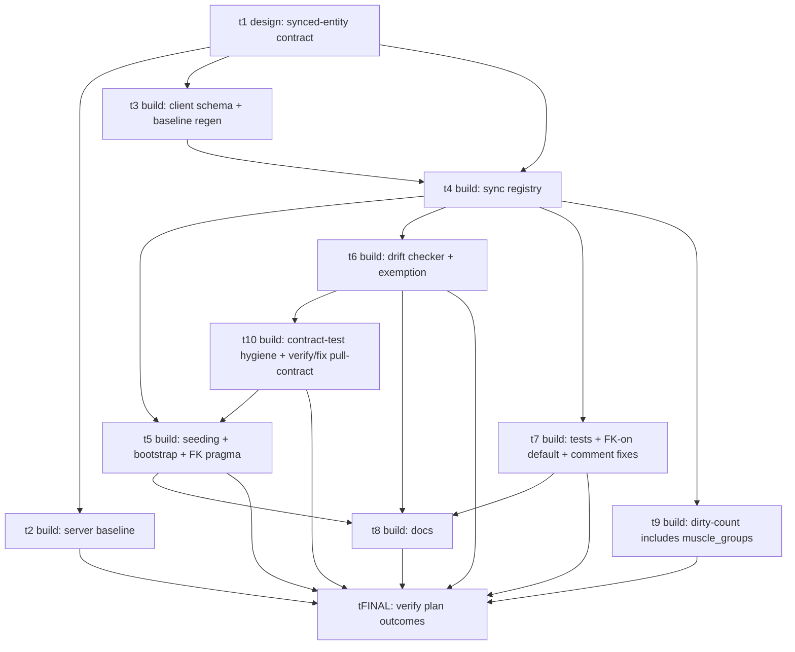

# Plan: muscle_groups synced entity

## Goal

Make `muscle_groups` a first-class per-user **synced** entity, treated identically to every other
synced table (its template is `exercise_definitions`: Layer 0, no FK dependencies, system-seeded as
a starter catalog). Today `muscle_groups` is a client-only, version-bundled taxonomy that never
syncs, yet `exercise_muscle_mappings.muscle_group_id` carries a NOT-NULL client FK into it while the
server stores that column as opaque text with no FK. We are also enabling SQLite FK enforcement
(`PRAGMA foreign_keys = ON`) at boot; under enforcement a cross-version taxonomy skew would brick
older devices. Making `muscle_groups` a normal per-user synced entity means the taxonomy travels
with the user's data on the same channel, the FK becomes a legitimate synced-parent FK
(Layer 0 → Layer 1), and the skew disappears. This change flows entirely through the generic
synced-entity machinery — no bespoke muscle-group logic — and is fresh-installs-only.

## Outcomes

Observable, specific, testable, bounded. The final test card verifies these end-to-end.

1. **Server has a per-user `app_public.muscle_groups` table mirroring `exercise_definitions`.** It
   has composite PK `(owner_user_id, id)`; the entity columns `display_name`, `family_name`,
   `sort_order`, `is_editable`, `created_at`, `updated_at`, `deleted_at`; the universal envelope
   columns (`client_updated_at_ms`, `server_received_at`); the `muscle_groups_owner_received_idx`
   index plus `family_name` / `sort_order` / `display_name` / `deleted_at` indexes; the
   `touch_server_received_at` and `owner_user_id_immutable` triggers; the four owner RLS policies; and
   grants to `authenticated` and `service_role`. It has zero CHECK constraints (per the
   no-server-validation rule).
2. **`exercise_muscle_mappings.muscle_group_id` is a real composite FK server-side:**
   `(owner_user_id, muscle_group_id) → app_public.muscle_groups(owner_user_id, id)`,
   `deferrable initially deferred`. The server in-file comment no longer claims `muscle_groups` is
   client-only / opaque text with no FK.
3. **The client `muscle_groups` schema is sync-shaped and round-trips on the wire.** It carries
   `deletedAt` (timestamp_ms, nullable), `localDirty` (boolean, notNull, default false),
   `localUpdatedAtMs` (integer, notNull, default 0), an `id` default of `lower(hex(randomblob(16)))`,
   and keeps `displayName` / `familyName` / `sortOrder` / `isEditable` / `createdAt` / `updatedAt`.
   The `muscle_groups_non_editable_guard` CHECK is dropped; the boolean guard and the
   `sort_order >= 0` guard remain. The client FK `muscleGroupId → muscleGroups.id` is preserved.
4. **The client baseline stays a single squashed `m0000`.** After `npm run db:generate`,
   `localRuntimeMigrations.journal.entries` has length 1 and its keys equal `['m0000']` (the
   `0000_living_bucky` tag is kept; no incremental client migration is added). The regenerated
   `drizzle/0000_living_bucky.sql`, `drizzle/meta/0000_snapshot.json`, and
   `drizzle/migrations.generated.ts` reflect the new `muscle_groups` shape and the dropped
   non-editable guard. `domain-schema-migrations.test.ts` is green.
5. **`muscle_groups` is registered as the 9th synced entity in the sync engine.** It is a member of
   `EntityTableName` and sits in **Layer 0** of `TOPO_LAYERS`; `ENTITY_FIELDS[muscle_groups]` and
   `ENTITY_TABLES[muscle_groups]` exist. The wire field set is exactly
   `display_name, family_name, sort_order, is_editable, created_at, updated_at, deleted_at`.
6. **`muscle_groups` is seeded through the generic starter-catalog path, dirty, version-marker
   gated.** Boot no longer seeds `muscle_groups` via a standalone every-boot additive seed
   (`seedMuscleGroups` as that standalone path is gone); rows are seeded `local_dirty = 1` by the
   same `seedSystemExerciseCatalog` path as `exercise_definitions`, gated by the existing
   `appliedSeedMigrationAppVersion` marker, and `account-wipe` clears/recovers them generically
   (no client-only special note). `PRAGMA foreign_keys = ON` is enabled at boot **after** migrations
   and **before** seeding.
7. **The schema-drift checker treats `muscle_groups` as a normal entity table.** The
   `untyped_text_references` exemption for `muscleGroupId` is removed from `sync-extras.json`; the
   checker derives 9 entity tables from the live schema (no hardcoded "8") and exits 0 under
   `--strict` with the new FK and table in place. `drift-check.test.ts` and
   `drift-exemption-removed.test.ts` assert the new state.
8. **A wiped/reinstalled client re-pulls `muscle_groups` (Layer 0) before
   `exercise_muscle_mappings` (Layer 1) under FK enforcement, and the FK holds.** With
   `PRAGMA foreign_keys = ON`, draining Layer 0 then Layer 1 never produces an FK violation and the
   device does not brick. The factually-false test comments claiming expo-sqlite enforces FKs "by
   default" / "ships" enforcement are corrected to "enforcement we enable at boot via
   `PRAGMA foreign_keys = ON`".
9. **The data-model and server-contract specs describe the new reality.** `docs/specs/05-data-model.md`
   lists `muscle_groups` as a per-user synced entity, states FK enforcement is enabled at boot, and
   records the invariant that client FKs only reference synced parents. `docs/specs/tech/sync-v2-server-contract.md`
   describes 9 entity tables, a real `muscle_group_id` FK, and removes the opaque-text / client-only
   rationale.

## Orchestration

- Status: enabled
- Plan slug (for PR filtering): `muscle-groups-synced-entity`
- Plan root: `docs/plans/muscle-groups-synced-entity/`
- Integration branch: `main`
- Host: `github`
- Host access: `gh` (account `dinoderek`, repo `Brotherhood-of-Ghisa/BOGA3`)
- Quality-gate command(s): `./scripts/quality-fast.sh` AND `npm run test:handles` (the open-handle
  guard is NOT in quality-fast and CI enforces it). Each card also runs the slow lane(s) its change
  area maps to per `docs/specs/02-quality-and-test-gates.md` — see each card's outcomes.
- Builder concurrency cap: 4
- Reviewer concurrency cap: unbounded
- Deviations from default protocol:
  - **PR body template override.** The skill's four-section PR body is REPLACED by the repo template
    `.github/pull_request_template.md` → **Objective / Tests / Review hard / Deviations from brief**,
    lean (~25 lines), data + `file:line` pointers, link don't quote. The **Tests** section MUST
    enumerate EVERY gate lane from `docs/specs/02-quality-and-test-gates.md` (fast / slow frontend /
    slow backend) with ✅ ran / ⛔ N/A plus a result + evidence link or one-line N/A reason each
    ("CI green" alone is insufficient). Every builder and reviewer follows this.
  - **Reviewers verify, do not re-run.** Reviewers check the build's evidence + regression test; they
    do not re-run the suite. Agents report to the coordinator; they do not auto-post PR verdicts
    outside the reviewer role.
  - **Durable-artifact hygiene.** Source, comments, test names, commit messages, and docs MUST NOT
    reference plan/card/design ids or `docs/plans/...` paths (the plan dir is deleted on landing).
    Self-contained comments only.

## DAG

## Tasks

- [t1: design the muscle_groups synced-entity contract](tasks/t1.md) — design
- [t2: server baseline — app_public.muscle_groups + composite FK](tasks/t2.md) — build
- [t3: client schema + single-baseline regen](tasks/t3.md) — build
- [t4: sync registry — topo-order + cycle field/table maps](tasks/t4.md) — build
- [t5: seeding + bootstrap + boot FK enforcement](tasks/t5.md) — build
- [t6: drift checker — drop muscleGroupId exemption, 9th entity](tasks/t6.md) — build
- [t7: tests — FK-on harness default, coverage, comment fixes](tasks/t7.md) — build
- [t8: docs — data-model + sync-v2 server contract](tasks/t8.md) — build
- [t9: dirty-count — include muscle_groups in the Settings pending-push count](tasks/t9.md) — build (added at execute time, iteration 5)
- [t10: remediate server-contract-test fallout — hygiene leaks + verify/fix pull-contract](tasks/t10.md) — build (added at execute time, iteration 7)
- [tFINAL: verify plan outcomes](tasks/tFINAL.md) — build (final test card)

## Deviations log

- t1 (PR #168, merged 2026-06-07): design only, no deviation from card. Canonical `designs/t1.md`
  pins items 1–5. Open sub-decision resolved: mappings FK on-delete = `cascade` (`set null`
  structurally impossible — `muscle_group_id` is NOT NULL; `cascade` matches the sibling
  `exercise_muscle_mappings_exercise_definition_fk`). Pointer markers added to t2–t8 + tFINAL.
- t2 (PR #170, merged 2026-06-07): server baseline. Deviation: builder edited beyond the 3 named
  files — fixed ~11 backend test shells (`supabase/tests/*.sh`) and extended `dev_wipe_my_data` to
  delete `muscle_groups` (both required to keep existing contract suites green under the new FK /
  9th entity; reviewer confirmed in-scope, no encroachment on t6/t7/tFINAL). Known consequence:
  `check:sync-drift --strict` is red on `main` until t6 lands (server-first window; plan outcome 7).
- t3 (PR #169, merged 2026-06-07): client schema + single-baseline regen. No deviation. Journal
  stays length-1 (`m0000`, tag `0000_living_bucky`); `muscle-group-bootstrap-idempotent.test.ts`
  left untouched (its premise is rewritten by t5/t7; still green).
- t4 (PR #171, merged 2026-06-07): sync registry — muscle_groups in Layer 0 + ENTITY_FIELDS/
  ENTITY_TABLES. Minor in-scope deviation: updated `topo-order-imported.test.ts` (8→9 Layer 0 shape
  guard) to keep the fast lane green. Surfaced a real downstream gap (`DIRTY_COUNTED_TABLES` in
  `sync-status.ts` excludes muscle_groups) → folded into the plan as new task **t9** (user decision).
