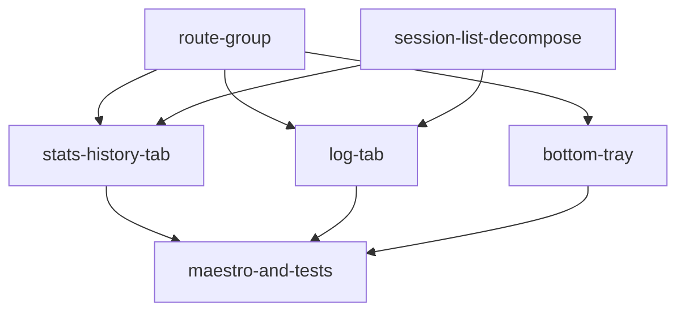

# Plan: navigation-redesign

## Goal

Replace `Sessions / Exercises / Stats / ⚙` with `Stats/History / Log / Exercises / ⚙` in a hideable bottom tray. Merge stats and session history into one tab with a top toggle. Make the Log tab the recorder (with a Start CTA when no active session). Drop the native stack header on tab roots. Keep `/session-recorder` as a route so sync cadence still works.

## Outcomes

- Three tabs (`Stats/History`, `Log`, `Exercises`) plus a Settings cog, in that order, inside a tray that can collapse to a peek strip.
- Stats/History tab has a top toggle between Stats and History sub-views.
- Log tab shows the recorder when a session is active, otherwise a Start Session button.
- Native header hidden on tab roots; detail screens keep their existing header and the tray.
- Existing Maestro flows and tests pass.

## Orchestration

- Status: enabled
- Plan slug: `navigation-redesign`
- Builder cap: 4
- Reviewers: unbounded
- Each task updates the docs (`docs/specs/ui/**`, `RUNBOOK.md` if applicable) that its own change affects — no separate docs task.

## DAG

## Tasks

### route-group: introduce `(tabs)` and hide tab-root headers

**Problem:** Tab roots live at the app root with default stack headers and each renders its own tab bar. We need a shared layout that owns the tray.

**Outcomes:**
- `app/(tabs)/_layout.tsx` hosts the three tab roots; tab files moved under `(tabs)/`. `/session-recorder` URL preserved.
- `headerShown: false` on tab roots; detail screens unchanged.
- `/session-list` and `/` redirect to `/stats-history`.

### session-list-decompose: pull reusable pieces out of `session-list.tsx`

**Problem:** The history list, session summary row, and active-session UI are entangled inside `session-list.tsx`. The Stats/History and Log tabs both need pieces of it.

**Outcomes:**
- History list, summary line, and active-session row + menu live in their own files and can be imported by other screens.
- `session-list.tsx` keeps working (still hit by Maestro until the maestro task runs) — either as a thin shell that composes the extracted pieces or as a redirect, builder's call.

### stats-history-tab: merged tab with a top Stats ↔ History toggle

**Problem:** The new Stats/History tab needs to render either view based on a top toggle, preserving per-view scroll state.

**Outcomes:**
- `app/(tabs)/stats-history.tsx` renders a toggle plus the two sub-views. History sub-view reuses the extracted history list.
- A small `SegmentedChips` primitive is extracted and used here (and substituted for the existing period chips in the Stats sub-view).
- Toggling does not lose scroll position.

### log-tab: Start CTA empty state + dismiss target

**Problem:** When no active session exists, the Log tab needs a clear way to start one. The recorder also currently dismisses to `/`, which would land on an empty Log tab after this change.

**Outcomes:**
- Log tab shows a single primary Start Session button when no active session exists; tapping creates a session and reveals the recorder.
- Recorder `dismissTo('/')` calls land on `/stats-history` instead.
- Active-session controls (resume, complete, delete) live in the Log tab.

### bottom-tray: hideable tray + reshape `TopLevelTabs`

**Problem:** The tray needs to be a single shared component, collapsible via a drag handle into a peek strip, with the three new tabs in the right order plus the Settings cog. `exercise-history.tsx` and any other direct caller of `TopLevelTabs` must continue to work.

**Outcomes:**
- `BottomTray` component handles the collapse/expand gesture; snap thresholds in a pure helper with tests.
- `TopLevelTabs` reshaped to the three new tabs plus the cog; all current callers updated.
- `(tabs)/_layout.tsx` uses `BottomTray` as its tab bar.

### maestro-and-tests: harness + test cleanup

**Problem:** `apps/mobile/src/maestro/harness.ts` and `apps/mobile/app/__tests__/ui-primitives.test.tsx` reference the old shape. They run last so they validate the integration.

**Outcomes:**
- Maestro `'session-list'` teleport returns `/stats-history`; existing flows pass.
- Tests updated for the new `TopLevelTabs` and tab routes.
- `apps/mobile/app/session-list.tsx` redirect stub removed if nothing else still hits it.

## Deviations log

_(empty until first merge)_
