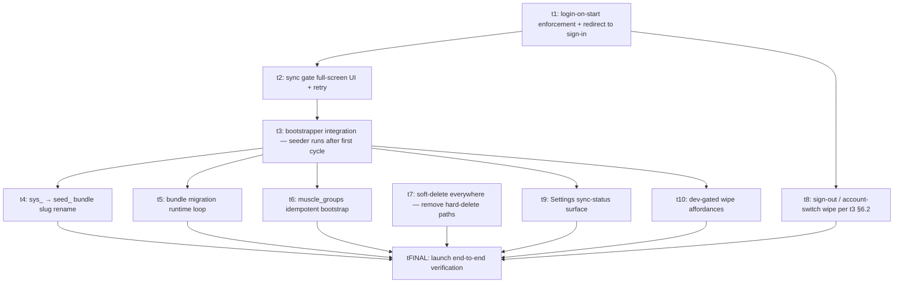

# Plan: Sync v2 — Launch (stub)

> **Stub.** Re-invoke the multi-agent-orchestration skill with
> `create multi-agent-orchestration-plan for sync-v2-launch at this path`
> to flesh out. This file is the seed: Goal, Outcomes, sketch DAG, sketch
> task list. No `tasks/` subfolder yet.
>
> **Depends on plans 1 and 2 (`docs/plans/sync-v2-server/`,
> `docs/plans/sync-v2-client/`) being merged** so the schema, RPCs,
> client cycle, and scheduler exist for this plan to layer login,
> sync-gating, and the seed reorder on top.

## Goal

Bring the v2 sync surface to a launchable product. Enforce login-on-start
(no anonymous mode); block app usage until the first sync cycle drains
(per t2 §5's `bootstrap_completed_at` flag); reorder the seeded catalog
loader to run **after** the first sync cycle per t3's bootstrapper
design; switch every entity to soft-delete-only (no hard delete UI path
remains); build the Settings sync-status surface per t4 §5.2's deferred
follow-up; finalise the dev-gated wipe affordances.

## Outcomes

When this plan is done, all of these are true (cross-cutting outcomes
from `docs/plans/sync-v2/plan.md` are restated here in
testable-on-day-of form):

- App routes redirect to a sign-in screen whenever `auth.uid()` is null.
  No anonymous-use path remains. A Maestro flow verifies a launch with
  no session lands on sign-in and does not render any data screens.
- App usage is blocked until `sync_runtime_state.bootstrap_completed_at`
  is non-null. While blocked, a "Setting up your data…" full-screen UI
  renders. On error a retry CTA shows the error message and a single
  Retry button. A Maestro flow verifies: fresh install → sign-in →
  block-screen visible → block-screen dismisses after the first cycle
  completes within 1 minute of foreground.
- The seeded catalog loader (current `seedExerciseCatalog`) runs **only
  after** `bootstrap_completed_at` is set, per t3 §1.1's
  bootstrapper:
  - `rowsPulled := runFirstFullPull()` drains all four layers per t2
    §4.4.
  - `if rowsPulled == 0:` runSeeder() inserts the bundle via the normal
    repo path (rows become `local_dirty = 1` and reach the server on
    the next cycle).
  - `bootstrap_completed_at := now()` set last.
- The seeder NEVER mutates `local_dirty` or `local_updated_at_ms`
  directly — it goes through repo paths that flip them naturally per
  t3 §1.4.
- The `sys_*` → `seed_*` bundle slug rename per t3 §2.3 lands. Bundle
  rows use stable slug IDs (`seed_bench_press`,
  `seed_map_bench_press__chest`, …).
- A bundle-migration mechanism per t3 §7.2 ships:
  `sync_runtime_state.applied_seed_migration_app_version` exists (plan
  2 may already have added the column; this plan adds the runtime
  loop), `BUNDLE_MIGRATIONS` array exists in the bundle module (empty
  for first ship), the runtime invokes pending migrations after the
  bootstrapper per t3 §7.2's `runBundleMigrations` pseudocode.
- `muscle_groups` bootstrap check is extended from "all-or-nothing on
  empty" to "insert any bundle row whose id is not already present
  locally" per t3 §8.2 #8.
- Every entity write path that previously did a hard DELETE now does a
  soft-delete (sets `deleted_at = Date.now()`, flips dirty bit). Local
  readers filter `WHERE deleted_at IS NULL` everywhere. A grep test
  confirms no `db.delete(<entity>)` remains in `apps/mobile/src/` for
  the eight entities (only the dev wipe affordance is allowed).
- The auth-layer sign-out / account-switch path wipes per t3 §6.2 #1–6:
  clears entity tables, resets `bootstrap_completed_at` to null, resets
  `pull_cursor` to `{}`, resets `applied_seed_migration_app_version` to
  0, **preserves** `last_emitted_ms`, **preserves** `muscle_groups`.
- Settings panel exposes a sync-status surface per t4 §5.2's deferred
  follow-up: last successful sync time, dirty count
  (`SELECT count(*) WHERE local_dirty = 1` across the eight tables),
  error state (last cycle's error, if any), network state (NetInfo's
  current `isInternetReachable`). Builds on / replaces v1's
  `profile-status.ts`. (If plan 2 already deleted `profile-status.ts`,
  this plan adds the new surface from scratch.)
- Dev-only wipe affordances behind `isDevMode()`: `wipe-local`,
  `wipe-remote-for-me`. (If plan 2 already shipped these, this plan
  confirms they're correct against the launch state and adds the
  Settings entry-point.)
- **Final test card asserts the end-to-end Outcomes from
  `docs/plans/sync-v2/plan.md`** — every cross-cutting outcome from
  the design wave's plan is exercised here. Specifically:
  1. Reinstalling the mobile app on the same device, then logging in,
     restores all exercises, sessions, sets, gyms, tags within one
     minute of foreground.
  2. Logging in to a fresh second device, with remote data present,
     restores all of the above within the same window.
  3. All v1 sync code paths and v1 server objects are gone
     (cross-checked against plans 1 + 2).
  4. Drift checker passes on the integration branch.
  5. Wipe-local and wipe-remote-for-me work behind `isDevMode()` gate.

## Sketch DAG

The re-dispatched planner should:

- Size every node against the ~2000-line budget; t7 (soft-delete
  everywhere) may need to split per entity.
- Check whether plan 2 already covered any of t10 (dev wipe
  affordances) and t8 (sign-out wipe — partially in plan 2's `t3:
  local-DB-wipe-on-v2-boot version marker`). If so, this plan's tasks
  reduce to the deltas; clarify the split.

## Sketch task list

- t1: login-on-start enforcement — auth-state guard at the route layer
  redirects to a sign-in screen when `auth.uid()` is null
- t2: sync-gate full-screen UI — block app usage until
  `bootstrap_completed_at` non-null; show "Setting up your data…";
  retry CTA on error
- t3: bootstrapper integration — wire the seeder behind the
  bootstrapper per t3 §1.1; seeder runs only when first-pull returned
  zero rows
- t4: `sys_*` → `seed_*` bundle slug rename per t3 §2.3
- t5: bundle migration runtime loop per t3 §7.2 — invoked after the
  bootstrapper, gated by
  `sync_runtime_state.applied_seed_migration_app_version`. Empty
  `BUNDLE_MIGRATIONS` list for first ship.
- t6: `muscle_groups` idempotent bootstrap per t3 §8.2 #8 — extend the
  existing all-or-nothing seeder to insert-if-not-exists
- t7: soft-delete everywhere — remove every hard-delete path in
  `apps/mobile/src/` for the eight entities (use `deleted_at` only).
  Local readers filter `WHERE deleted_at IS NULL`. **May split** per
  entity if size budget binds.
- t8: sign-out / account-switch wipe per t3 §6.2 — auth-layer responds
  to sign-out with the exact wipe checklist (clear entity rows, reset
  `bootstrap_completed_at`, `pull_cursor`,
  `applied_seed_migration_app_version`; preserve `last_emitted_ms`,
  `muscle_groups`)
- t9: Settings sync-status surface per t4 §5.2 — replaces
  `profile-status.ts` (or builds anew if plan 2 deleted it)
- t10: dev-gated wipe affordances (delta vs plan 2) — Settings
  entry-point, `isDevMode()` gating
- tFINAL: launch end-to-end verification — Maestro flows for each
  outcome above; the five cross-cutting outcomes from
  `docs/plans/sync-v2/plan.md` are the test contract

## Notes for the planner re-dispatch

- The cross-cutting outcomes in `docs/plans/sync-v2/plan.md` `## Outcomes`
  are the **launch contract** — the final test card here asserts them
  1:1.
- `docs/plans/sync-v2/designs/t3.md` is authoritative for the
  bootstrapper, slug rename, bundle migration mechanism,
  sign-out-wipe checklist (§6.2), `muscle_groups` extension.
- `docs/plans/sync-v2/designs/t4.md` §5.2 lists the deferred sync-status
  surface and "Sync now" UX — the launch plan picks them up.
- Apply the user's `isDevMode()` rule (not `__DEV__`) on any dev-only
  affordance.
- Maestro / e2e gates from the user-memory file
  (`feedback_run_sim_gates.md`) — run `test:e2e:ios:smoke` +
  `test:e2e:ios:data-smoke` before declaring this plan's PRs done.
- This plan is the last of the three. After tFINAL passes, the design
  wave's `docs/plans/sync-v2/plan.md` outcomes are fully delivered.

## Deviations log

<empty until re-dispatch>
