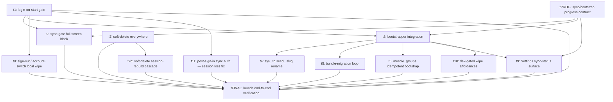

# Plan: Sync v2 — Launch

Third and final plan in the Sync v2 design wave. Plans 1 (`sync-v2-server`,
merged 2026-05-26) and 2 (`sync-v2-client`, merged 2026-06-01) are merged into
`main`; this plan layers login, sync-gating, the seed reorder, soft-delete, and
the launch surfaces on top. The authoritative design lives in
`docs/plans/sync-v2/designs/t3.md` (bootstrapper, `sys_*→seed_*` rename, bundle
migrations, sign-out wipe §6.2, muscle-group extension) and
`docs/plans/sync-v2/designs/t4.md` §5.2 (sync-status surface). Cards cite those
docs; they do not restate them.

## Goal

Bring the v2 sync surface to a launchable product. Enforce login-on-start (no
anonymous mode); block app usage until the first sync cycle drains (per the
`bootstrap_completed_at` flag); reorder the seeded catalog loader to run **after**
the first sync cycle per the bootstrapper design; switch every entity to
soft-delete-only (no hard-delete UI path remains); build the Settings
sync-status surface; finalise the dev-gated wipe affordances.

## Outcomes

When this plan is done, all of these are true (the cross-cutting outcomes from
`docs/plans/sync-v2/plan.md` are the launch contract; tFINAL asserts them 1:1):

- **Login-on-start.** When the auth snapshot reports no session and auth is
  configured, the route layer redirects to a sign-in screen before any data
  screen renders. No anonymous-use path reaches a data screen. A sync cycle that
  ends `AUTH_REQUIRED` routes the user to sign-in, not a generic error.
- **Sync gate.** While `sync_runtime_state.bootstrap_completed_at` is null for
  the signed-in user, a full-screen "Setting up your data…" block renders and no
  data screen is reachable; it dismisses once the flag is set. On a cycle error
  the block shows the error and a single Retry button; Retry does NOT fire a
  cycle when the latest outcome is `AUTH_REQUIRED`. The block also makes a
  stalled gate self-explanatory: it surfaces (a) the **current phase** label of
  the first-sync/bootstrap (pull / push / seed / etc. per the progress contract
  in `designs/tPROG.md`); (b) an **intra-phase activity/progress signal** that
  visibly advances while work is happening (the exact representation —
  percentage, item/row count, page/cycle counter, or a phase+heartbeat liveness
  signal — is fixed by `designs/tPROG.md`); and (c) a **network-unreachable /
  offline message** when the device is offline, so an offline device shows the
  offline message rather than spinning indefinitely with no explanation.
- **Bootstrapper-after-cycle.** The seeded catalog loader runs only inside the
  bootstrapper, gated on the first full pull returning zero rows
  (`rowsPulled == 0`, tombstones counted), and `bootstrap_completed_at` is set
  LAST so a crash re-attempts cleanly. The seeder writes via the normal repo
  path and never sets `local_dirty` / `local_updated_at_ms` directly.
- **Slug rename.** Every bundle slug uses the `seed_*` lineage prefix
  (`seed_bench_press`, `seed_map_bench_press__chest`, …); no `sys_*` id remains;
  `muscle_groups` ids stay bare slugs.
- **Bundle-migration loop.** `BUNDLE_MIGRATIONS` exists (empty for first ship)
  and a `runBundleMigrations()` loop runs after the bootstrapper, applying every
  migration with `appVersion > applied_seed_migration_app_version` in ascending
  order (each in its own transaction, advancing the marker in that transaction).
- **Muscle-group idempotency.** The `muscle_groups` bootstrap inserts any bundle
  row whose id is not already present locally (not all-or-nothing-on-empty),
  without overwriting existing rows.
- **Soft-delete everywhere.** Every user-facing hard-delete path on the 8
  entities sets `deleted_at = Date.now()` + flips the dirty bit via the normal
  repo path; local readers filter `WHERE deleted_at IS NULL`; a grep test
  confirms no disallowed `db.delete(<entity>)` remains in `apps/mobile/src/`
  outside the exempt dev/fixture sites.
- **Sign-out / account-switch local wipe.** Sign-out (and an `auth.uid()` change)
  clears the 8 entity tables and resets `bootstrap_completed_at` → null,
  `pull_cursor` → `{}`, `applied_seed_migration_app_version` → 0 on the
  `'primary'` runtime-state row, while preserving `last_emitted_ms` and
  `muscle_groups`. It is LOCAL only — no server delete.
- **Settings sync-status surface.** The scheduler exposes a production state
  accessor; Settings shows last successful sync time, dirty count
  (`count(*) WHERE local_dirty = 1` across the 8 tables), error state, and
  network state (NetInfo `isInternetReachable` projection). Built anew (v1's
  `profile-status.ts` is deleted).
- **Dev-gated wipes.** `wipe-local` and `wipe-remote-for-me` are reachable from
  Settings only when `isDevMode()` is true, throw synchronously when it is false,
  and perform their wipes correctly against the launch state.
- **End-to-end (final test card).** The five cross-cutting outcomes from
  `docs/plans/sync-v2/plan.md` are each asserted by an automated test: (1)
  same-device reinstall → login → full restore within 1 min of foreground; (2)
  fresh second device with remote data → same restore in the window; (3) all v1
  sync code paths + v1 server objects are gone; (4) drift checker passes on the
  integration branch; (5) wipe-local + wipe-remote-for-me work behind the
  `isDevMode()` gate.

## Orchestration

- Status: enabled
- Plan slug (for PR filtering): `sync-v2-launch`
- Plan root: `docs/plans/sync-v2-launch/`
- Integration branch: `main`
- Host: `github`
- Host access: `gh` (no GitHub MCP in this environment; `gh` CLI is
  authenticated)
- Quality-gate command(s):
  - Fast (every PR): `./scripts/quality-fast.sh frontend` (apps/mobile lint +
    typecheck + jest; infra-free)
  - Slow / Maestro (MANDATORY for any UI-touching PR — standing user rule for
    `apps/mobile` UI changes): `npm run test:e2e:ios:gates` (combined smoke +
    data-smoke runner)
  - Live round-trip / two-device restore (tFINAL only, infra lane):
    `npm run test:sync:infra` and `npm run test:sync:reinstall-parity`
    (branch-provisioned; excluded from CI's fast `npm test`)
  - Drift (only if a task touches an entity Drizzle schema — unlikely here):
    `npm run check:sync-drift -- --strict`
- Builder concurrency cap: 4
- Reviewer concurrency cap: unbounded
- Deviations from default protocol: this plan was fleshed out from a
  pre-existing detailed stub — Goal, Outcomes, and the two Carry-over sections
  were authored before planning and are preserved (the Carry-over sections are
  as-built facts / load-bearing constraints, not deviations). One design task
  (`tPROG`) was added in a later revision to fix the sync/bootstrap
  progress-reporting contract consumed by t2/t3/t9 (see PR body for the
  judgment); the original plan shipped with zero design tasks.

## DAG

Edge justifications (each edge is a hand-off one task produces and the next
consumes):

- `tPROG → t2`: t2 renders the progress contract (phase label, intra-phase
  activity signal, offline message) that tPROG fixes in `designs/tPROG.md ##
  Decision`.
- `tPROG → t3`: t3's bootstrapper produces phase + intra-phase progress
  (per-layer pull, seed) sourced as tPROG decides.
- `tPROG → t9`: t9's single shared scheduler state accessor surfaces the
  phase/progress/network shape tPROG defines (the gate and Settings both consume
  it).
- `t1 → t2`: t2's gate sits below t1's route-layer auth guard and consumes t1's
  `AUTH_REQUIRED` → route-to-sign-in hook.
- `t1 → t3`: the bootstrapper runs on the first auth-gated sign-in, downstream
  of t1's guard.
- `t1 → t8`: the sign-out / account-switch wipe lives in the auth layer t1's
  gate is built around; after the wipe an account switch re-enters t1's gate.
- `t3 → t4`: the renamed bundle is inserted via t3's bootstrapper `rowsPulled ==
  0` branch.
- `t3 → t5`: the bundle-migration loop runs after t3's bootstrapper.
- `t3 → t6`: t6 edits the muscle-group seed path that t3 keeps decoupled from
  the entity bootstrapper.
- `t3 → t9`: the status surface reads the runtime-state shape t3 finalises.
- `t3 → t10`: wipe-local's re-bootstrap must compose with t3's reorder.
- `tPROG` is an independent root within this plan: it composes only with
  already-merged plan-2 code (the scheduler four-state machine + log events +
  `isInternetReachable` projection) and the sync-v2 design docs
  (`docs/plans/sync-v2/designs/t3.md`, `…/t4.md` §5.2) — no in-plan build
  dependency. (It has no direct `→ tFINAL` edge: its contract is verified
  through the expanded sync-gate outcome that t2/t9 deliver and tFINAL asserts.)
- `t7` is an independent root (soft-delete repo paths depend on nothing built
  here).
- everything `→ tFINAL`: the final test card asserts the union of outcomes.

## Tasks

- [tPROG: sync/bootstrap progress-reporting contract](tasks/tPROG.md) — design
- [t1: login-on-start enforcement — redirect to sign-in](tasks/t1.md) — build
- [t2: sync-gate full-screen block until first cycle drains](tasks/t2.md) — build
- [t3: bootstrapper integration — seeder runs only after the first cycle](tasks/t3.md) — build
- [t4: `sys_*` → `seed_*` bundle slug rename](tasks/t4.md) — build
- [t5: bundle-migration runtime loop](tasks/t5.md) — build
- [t6: `muscle_groups` idempotent bootstrap](tasks/t6.md) — build
- [t7: soft-delete everywhere — convert hard-delete repo paths](tasks/t7.md) — build (split: shipped tag+mapping+simple paths in PR #108; session-rebuild cascade → t7b)
- [t7b: soft-delete the session-rebuild cascade](tasks/t7b.md) — build (split from t7; depends on t7 merged)
- [t8: sign-out / account-switch local wipe](tasks/t8.md) — build
- [t9: Settings sync-status surface (+ scheduler state accessor)](tasks/t9.md) — build
- [t10: dev-gated wipe affordances — confirm correct against launch state](tasks/t10.md) — build (verification delta)
- [t11: post-sign-in sync authentication — session loss fix](tasks/t11.md) — build (remediation; surfaced by t2's Maestro work; gates t2's #113 lane-green merge)
- [tFINAL: launch end-to-end verification](tasks/tFINAL.md) — build (final test card)

## Planner notes (folded from the stub)

- The five cross-cutting outcomes in `docs/plans/sync-v2/plan.md` `## Outcomes`
  are the launch contract; tFINAL asserts them 1:1.
- `docs/plans/sync-v2/designs/t3.md` is authoritative for the bootstrapper, the
  slug rename, the bundle-migration mechanism, the sign-out-wipe checklist
  (§6.2), and the `muscle_groups` extension. `docs/plans/sync-v2/designs/t4.md`
  §5.2 is authoritative for the sync-status surface. Cards cite these in their
  `Inputs`.
- `tPROG` is this plan's only design task. Its design doc
  `docs/plans/sync-v2-launch/designs/tPROG.md` is produced at execute time by the
  designer — the `designs/` dir does not exist yet. Once it lands it is the
  canonical, binding contract for the phase / intra-phase progress / offline
  signal that t2 renders, t3 produces, and t9 surfaces; those cards cite it (they
  do not restate it).
- Apply `isDevMode()` (never `__DEV__`) on any dev-only affordance so it survives
  the `com.phano.boga3.dev` TestFlight build.
- Any UI change in `apps/mobile` runs the Maestro gates (`npm run
  test:e2e:ios:gates`) before the PR is declared done (standing user rule).
- Durable-code rule: source / comments / tests / commit messages must NOT
  reference plan/card/design ids (`t3`, `§6.2`, `tFINAL`, the plan slug) or
  `docs/plans/...` paths — those are ephemeral. Cards may cite design docs in
  `Inputs`; the code builders write must be self-contained.
- The v1→v2 wipe runbook lives at `docs/manual-wipe-v1-to-v2.md` — reference
  that, not retired plan dirs.
- After tFINAL passes, the design wave's `docs/plans/sync-v2/plan.md` outcomes
  are fully delivered.

## Carry-over from plan 1 (sync-v2-server, merged 2026-05-26)

The following are as-built facts:

1. **`sync_push` and `sync_pull` are granted `execute` to `anon`** in addition
   to `authenticated`. This is load-bearing for plan 3's login-gate behaviour: a
   pre-login app that calls either RPC receives the structured `AUTH_REQUIRED`
   envelope (per t2 §2.2), NOT a raw 401. Plan 3's t2 (sync-gate full-screen UI)
   and t1 (login-on-start enforcement) must handle the envelope:
   - The cycle returning AUTH_REQUIRED means "not signed in" — route the user to
     the sign-in screen rather than rendering a generic error. Treat it as a
     route signal, not an exception.
   - The sync gate's retry CTA must NOT re-trigger a cycle if the latest error
     envelope is AUTH_REQUIRED (a retry will get the same envelope; the user
     needs to sign in first).

2. **The bootstrap pull walks the corrected layer partition** (Layer 0: `gyms`,
   `exercise_definitions`; Layer 1: `sessions`, `exercise_muscle_mappings`,
   `exercise_tag_definitions`; Layer 2: `session_exercises`; Layer 3:
   `exercise_sets`, `session_exercise_tags`). Plan 3's t3 (bootstrapper
   integration) inherits this from plan 2's cycle; no plan-3 task should redefine
   the layers.

3. **`gyms` carries the four M15 location columns** — relevant only if plan 3's
   Settings sync-status surface (t9) ever surfaces `gyms`-touching state.
   Otherwise no direct impact on plan 3.

4. **`sync_runtime_state.applied_seed_migration_app_version`** — plan 2 added
   this column. Plan 3's t5 (bundle migration runtime loop) consumes it; t5 is
   responsible for the loop only.

5. **Drift checker is live in the slow gate** (plan 1). Any plan-3 PR that
   touches an entity Drizzle schema (unlikely — most plan-3 work is UI / auth)
   must pass `npm run check:sync-drift -- --strict` before review.

6. **Spec edit landed in `docs/specs/05-data-model.md`**: a "Client schema drift
   rule (Sync v2)" subsection. Plan 3's PR-time guidance for AI agents should
   reference it.

## Carry-over from plan 2 (sync-v2-client, merged 2026-06-01)

Plan 2 is fully merged + audited (PASS). The following are as-built facts and
load-bearing constraints. Source of record: the `sync-v2-client`
`## Deviations log` (captured in PR #104; the plan dir was retired in PR #105)
and the referenced PRs.

1. **`app_public` schema on EVERY Supabase RPC call.** The Supabase client
   (`apps/mobile/src/auth/supabase.ts`) sets no default `db.schema`, but the sync
   RPCs live in `app_public`. `cycle.ts` and `dev-affordances.ts` therefore call
   `client.schema('app_public').rpc(...)` (a bare `.rpc()` on the default
   `public` schema silently never reaches the function). **Any new RPC call plan
   3 adds (e.g. t8 account-switch, or a t9 status query) MUST
   `.schema('app_public')`.** Match the `apps/mobile/src/auth/profile.ts`
   convention.

2. **Dev-wipe affordances ALREADY shipped (plan 2, PR #99) — launch t10
   collapses to a verification delta.** `apps/mobile/src/sync/dev-affordances.ts`
   exports `wipeLocalAndReBootstrap()` + `wipeRemoteForCurrentUser()` (both throw
   synchronously when `!isDevMode()`); both buttons already live in the
   `isDevMode()` block of `app/(tabs)/settings.tsx`; the
   `app_public.dev_wipe_my_data()` RPC (security definer, env-guarded to non-prod
   via `FORBIDDEN_ENV`) is migrated + contract-tested. ⇒ Launch t10 is "confirm
   correct against launch state," not net-new. **Caveat for t8:**
   `dev_wipe_my_data` is non-prod-gated AND is a SERVER delete — t8's production
   sign-out/account-switch wipe must NOT reuse it. t8's wipe is LOCAL (clear
   local entity tables + reset runtime-state per §6.2), preserving server data.

3. **Settings sync-status surface (t9): the scheduler has NO production state
   accessor.** `apps/mobile/src/sync/scheduler.ts` exports only
   `startSyncScheduler` / `stopSyncScheduler` / `requestSync` / the four-state
   types / `__getSchedulerStateForTests` (test-only). Plan 3 t9 must ADD a real
   read API (current state, last-cycle error, online projection) or derive
   status from `sync_runtime_state` + the structured log events the scheduler
   emits (`sync_scheduler_transition`, `sync_scheduler_cycle_error`,
   `sync_scheduler_ignored_event`, `sync_scheduler_foreground_sync_requested`,
   `sync_scheduler_start_failed` — via `apps/mobile/src/logging/logEvent.ts`).
   Network state = the scheduler's NetInfo `isInternetReachable` projection;
   dirty count = `SELECT count(*) WHERE local_dirty = 1` across the 8 tables.
   `apps/mobile/src/sync/profile-status.ts` is **deleted** (confirmed) → t9
   builds the surface from scratch.

4. **Scheduler wiring failure CRASHES boot (re-throws), not silent-offline.**
   `startSyncScheduler` logs at `error` then **re-throws** if NetInfo/AppState
   listener wiring fails — a broken native build hard-crashes at boot rather than
   landing in a recoverable "offline" UI state. Plan 3 t1/t2 (login / sync-gate
   UX) should treat a wiring failure as a crash, not a UI error state. (Only
   triggers on a genuinely broken build; healthy builds never throw here.) The
   `requestSync()` entry point takes NO `reason` param — login/gate trigger sync
   via the same parameterless call.

5. **`sync_runtime_state` as-built + seed marker (relevant to t2/t5/t8).**
   Columns: `pull_cursor` (json keyed `"0".."3"`), `last_emitted_ms`,
   `bootstrap_completed_at` (nullable `timestamp_ms`),
   `applied_seed_migration_app_version` (default 0). Singleton row id is
   `PRIMARY_RUNTIME_STATE_ID = 'primary'` (`apps/mobile/src/data/clock.ts`). The
   seed marker was migrated from a timestamp to an app-version integer:
   `apps/mobile/src/data/exercise-catalog-seeds.ts` exports
   `SEED_CATALOG_BUNDLE_VERSION = 1` plus read/write helpers for the marker. ⇒ t5
   (bundle-migration loop) adds only the `BUNDLE_MIGRATIONS` array + the runtime
   loop (column + marker helpers already exist). t8 (sign-out wipe) resets these
   columns on the `'primary'` row.

6. **`deleted_at` + index on all 8 entities; the cycle already emits it.** The
   soft-delete columns + `deletedAtIdx` exist on every entity schema and the
   cycle's wire serialisation includes `deleted_at`. ⇒ t7 (soft-delete
   everywhere) only needs to (a) flip each hard-delete repo path to set
   `deleted_at = Date.now()` + the dirty bit, and (b) make readers filter
   `WHERE deleted_at IS NULL`. **Known remaining hard delete:**
   `removeTagAssignment` (`session_exercise_tags`, `exercise-tags.ts`) was left
   as a hard `DELETE` by plan 2 (deferred here) — t7 converts it. Grep
   `db.delete(` / `.delete(` across the 8 entities for the rest.

7. **Test-lane + infra conventions (as-built; tFINAL must follow).** Two lanes:
   `test:sync` (fast, infra-free, runs in CI's `npm test`) and `test:sync:infra`
   (Supabase/branch-dependent — cycle round-trip, AUTH_REQUIRED, drift —
   **excluded from CI's fast `npm test`** via `jest.config.js`
   `testPathIgnorePatterns`; **fails hard** when `SUPABASE_BRANCH_URL` /
   `SUPABASE_BRANCH_ANON_KEY` are unset). Jest hang-safety: `testTimeout: 15000`,
   a global inert Supabase mock, and `npm run test:handles` (open-handle guard) —
   never add `--forceExit`. iOS Maestro: the combined `npm run test:e2e:ios:gates`
   runner (one provision/launch/warm/teardown for both flows); sims
   auto-provision + pre-authorize URL schemes AND location. ⇒ Plan 3's tFINAL
   live/round-trip tests (the two-device restore outcomes) go in an infra lane
   like `test:sync:infra` (branch-provisioned, out of CI's fast lane), and
   Maestro flows use `test:e2e:ios:gates`.

8. **Migrations: single baseline + generated bundle.** History is squashed to one
   `apps/mobile/drizzle/0000_living_bucky.sql` baseline; the runtime bundle
   `apps/mobile/drizzle/migrations.generated.ts` is produced by
   `apps/mobile/scripts/bundle-migrations.ts` (chained into `db:generate`). Plan
   3 is mostly UI/auth and should add NO schema migration (the `sys_*→seed_*`
   rename is bundle DATA, not a migration). If any plan-3 task does add one, it
   appends after the baseline and must re-run `bundle-migrations.ts`.

9. **Durable docs / protocol.** The v1→v2 wipe runbook moved to
   `docs/manual-wipe-v1-to-v2.md` (plan-2 teardown) — reference that path, not
   the retired `docs/plans/sync-v2-client/...`. The mao skill enforces: no
   ephemeral plan/card/design ids (`t1`, `§`, `docs/plans/...`, plan slug) in
   durable code/comments/tests; coordinator syncs to `main` after every merge;
   agents branch from the latest `origin/main`. Plan 3's builders inherit these.

## Deviations log

- tPROG (PR #107, merged 2026-06-01): progress-reporting contract landed
  (`designs/tPROG.md` — `SyncProgress` = phase + denominator-free counters
  `layersCompleted`/`rowsApplied` + `offline`; t3 produces, t9 surfaces via the
  single accessor, t2 renders) + pointer edits to t2/t3/t9. Deviation: an earlier
  revision leaked 3 build files (`exercise-tags.ts`, `auth-required-signal.ts`,
  `cycle.ts`) from a polluted base; coordinator reverted them pre-merge so the PR
  is design-only.
- t7 (PR #108, merged 2026-06-01): soft-delete conversion of tag-assignment +
  muscle-mapping + simple-delete paths + reader filters + grep guard test.
  Deviation: SPLIT — the `session-drafts.ts` session-rebuild cascade is deferred
  to new card t7b (DAG: t7 → t7b → tFINAL). The `Builder-Agent:` commit trailer
  was accepted by coordinator ruling (subsequently removed from the skill agent
  defs entirely to resolve the underlying inconsistency).
- t1 (PR #109, merged 2026-06-01): login-on-start route guard + sign-in screen +
  AUTH_REQUIRED→sign-in hook + nav-contract/screen-map docs + Maestro flow.
  Deviation: 3 minor card deviations logged in the PR (guard clamped to
  `isConfigured`; sign-in-landing Maestro assertion placed in the auth-configured
  lane; `auth-profile-happy-path.yaml` adapted to the new launch contract).
  `Builder-Agent:` trailer accepted per the same ruling.
- (out-of-band) PR #115 (merged 2026-06-03): `fix(mobile): seed starter catalog
  dirty so a fresh account pushes it` — resolves the concern flagged at t3 review
  (the as-built seeder wrote seeds `local_dirty=0`, so fresh-account seeds never
  pushed). Shipped via the reviewer-spawned task chip, OUTSIDE this orchestration;
  main advanced to 71ea317. t3 (#111) + t7b (#112) remained CLEAN/mergeable on top.
  Downstream note: t4 (slug rename) + t5 (bundle migration) must compose with the
  now-dirty seeder. Resolves open-concern #1 from iteration 5.
- t3 (PR #111, merged 2026-06-03): bootstrapper integration — seeder runs only
  inside the bootstrapper behind `rowsPulled == 0`, `bootstrap_completed_at` set
  last; produces the `SyncProgress` snapshot (`apps/mobile/src/sync/progress.ts`,
  `getSyncProgress`). Deviation: reviewer flagged the as-built seeder wrote seeds
  `local_dirty=0` — resolved out-of-band by #115; t3 composes with the now-dirty
  seeder.
- t7b (PR #112, merged 2026-06-03): session-rebuild cascade converted to
  soft-delete-then-reconcile (scratch-band/allocator keeps the `order_index`/PK
  invariants against the non-partial local unique index); guard test no longer
  exempts `session-drafts.ts`. Deviation: filtered two readers beyond the card's
  named list (`exercise-catalog-stats.ts` + the in-file draft loader).
- t11 (PR #116, merged 2026-06-03): post-sign-in auth-session fix. REAL,
  launch-blocking bug — a signed-in Supabase session exceeds the iOS keychain's
  2048-byte per-entry limit, so the old single-key auth storage adapter silently
  persisted NOTHING → cycle `getSession()` null → spurious AUTH_REQUIRED →
  sign-in bounce loop for every user. Fix: chunk oversized values across keychain
  entries (`apps/mobile/src/auth/storage.ts`); enforced regression gate in CI's
  fast lane (`auth-session-visibility.test.ts`, real GoTrue client vs a 2048-byte
  ceiling). Deviation: remediation task added mid-plan (surfaced by t2's Maestro
  work; the prior session-loss it masked was never caught because the auth-profile
  Maestro lane is excluded from CI). The iOS auth-profile lane still needs a host
  run (local Supabase) to green `launch-requires-sign-in.yaml` end-to-end —
  deferred to tFINAL's provisioned infra lane / a host.
- t8 (PR #110, merged 2026-06-03): sign-out / account-switch LOCAL wipe (§6.2) —
  clears the 8 entity tables + resets the runtime-state row, preserves
  `last_emitted_ms` + `muscle_groups`, no server delete. Rebased post-t7b/t11
  (guard-test exempt-list union: {dev-reset, account-wipe}, not session-drafts).
- t4 (PR #117, merged 2026-06-03): `sys_*` → `seed_*` bundle slug rename
  (`seed_<slug>`, `seed_map_<exercise>__<muscle>`); muscle-group ids stay bare;
  #115's dirty-write preserved; no Drizzle migration. none.
