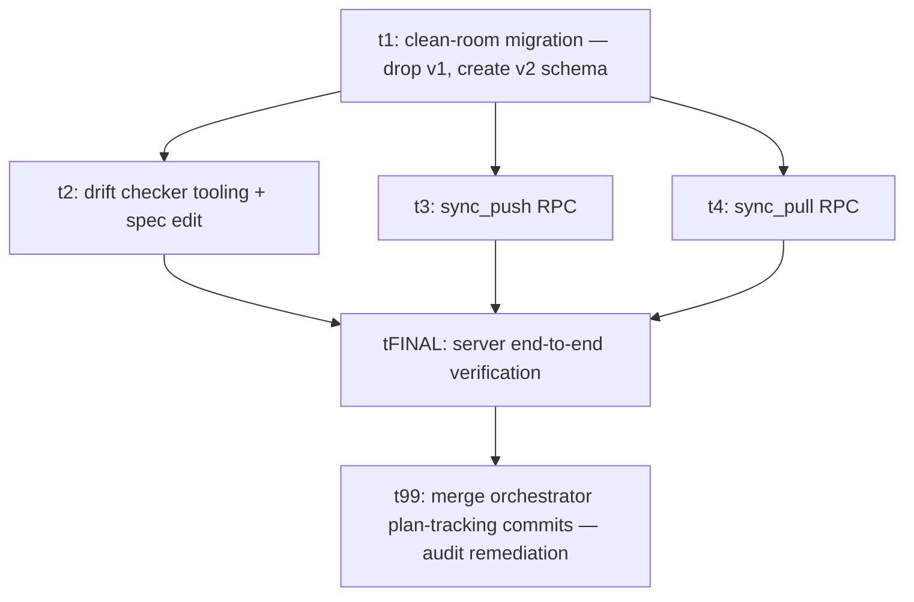

# Plan: Sync v2 — Server

## Goal

Rebuild the Supabase side of sync from a clean slate to match the v2 design.
v1 (M13) layered a 1500-line projection function, an event-log table, and
per-entity event-ingest dispatch on top of the eight user-owned tables. The v2
designs (`docs/plans/sync-v2/designs/{t1,t2}.md`) replace that surface with a
typed mirror of the client Drizzle schemas plus two thin RPCs (`sync_push`,
`sync_pull`) doing LWW upsert and cursor-paged pull. This plan ships **only**
the server-side surface — fresh migrations, the two RPCs, the drift checker
wired into the slow gate, and the agent-reminder edit to
`docs/specs/05-data-model.md`. No client code changes here.

This is **plan 1 of 3** for sync v2. Plan 2 (`docs/plans/sync-v2-client/`)
rebuilds the client sync engine against this server. Plan 3
(`docs/plans/sync-v2-launch/`) adds login-gate, sync-gate, seed reorder,
and the settings sync surface.

## Outcomes

When this plan is done end-to-end, all of these are true:

- A single new migration under `supabase/migrations/` drops every v1 sync
  server object — `app_public.sync_apply_projection_event`,
  `app_public.sync_events_ingest`, `app_public.sync_events_ingest_impl`,
  `app_public.sync_ingest_failure`, `app_public.sync_device_ingest_state`,
  `app_public.sync_ingested_events`, and all eight legacy entity tables from
  `20260514120000_user_scoped_pk_redesign.sql` (`gyms`, `sessions`,
  `session_exercises`, `exercise_sets`, `exercise_definitions`,
  `exercise_muscle_mappings`, `exercise_tag_definitions`,
  `session_exercise_tags`) **and** creates the v2 shape clean. Running
  `supabase db reset --local` against the migration tree leaves zero v1
  objects in `pg_proc` / `pg_class` and the eight v2 tables present per t1
  §2.
- Each of the eight `app_public.<entity>` tables has composite PK
  `(owner_user_id, id)`, the universal columns `owner_user_id` /
  `client_updated_at_ms` / `server_received_at` / `deleted_at` per t1 §2, the
  per-entity btree indexes per t1 §2 (including the partial `WHERE deleted_at
  IS NULL` indexes for the order/normalised-name lookups), and zero CHECK
  constraints (per t1 §1, "no server validation").
- Each of the eight tables carries the universal
  `<table>_owner_received_idx`, the `<table>_touch_server_received_at`
  trigger, and the `<table>_owner_user_id_immutable` trigger per t1 §2 / §6.3.
  The immutability trigger body matches the canonical text in t1 §6.3 (uses
  `IS DISTINCT FROM` and the explicit `auth.uid() IS NULL` guard).
- All eight cross-entity FKs are composite `(owner_user_id, <parent_id>)
  → (owner_user_id, id)` and `DEFERRABLE INITIALLY DEFERRED` per t1 §5.2.
  An automated test inserts a child before its parent in one transaction
  and observes COMMIT succeeds.
- RLS is enabled on every entity table with the four `_owner_{select,insert,
  update,delete}` policies from t1 §6.1. An automated test confirms a JWT
  for user A cannot SELECT, INSERT, UPDATE, or DELETE rows owned by user B
  (all four operations return zero rows or RLS-deny).
- The `sync_push` RPC at `POST /rest/v1/rpc/sync_push` accepts the wire
  envelope per t2 §3.1 — `{entities: Entity[]}` with `entities.length
  1..200` — runs `SET CONSTRAINTS ALL DEFERRED` inside a single
  transaction, upserts every row by `(owner_user_id, id)` with the t1
  §1.1.1 LWW predicate (`incoming.client_updated_at_ms >
  stored.client_updated_at_ms`), clamps incoming `client_updated_at_ms` to
  `now_ms() + 5*60*1000` per t1 §1, and returns `{ok: true,
  server_received_at}` per t2 §3.5. On FK closure failure the entire
  transaction rolls back and the RPC returns the `FK_VIOLATION` error
  envelope from t2 §2.2.
- The `sync_pull` RPC at `POST /rest/v1/rpc/sync_pull` accepts the
  layer-cursor envelope per t2 §4.1, returns up to `limit` rows from
  tables in the requested layer ordered by `(server_received_at,
  owner_user_id, type, id)` per t2 §4.3, and emits `{entities, next_cursor,
  has_more}` per t2 §4.2. An automated test drains a multi-page layer with
  a cap of `limit=2` and observes every committed row exactly once across
  pages, in cursor order.
- **Layer→type mapping integrity and client-FK closure.** The server's
  layer→types mapping matches t2 §4.4 exactly: every one of the eight
  entity types appears in exactly one layer (Layer 0: `gyms`,
  `exercise_definitions`, `exercise_tag_definitions`; Layer 1: `sessions`,
  `exercise_muscle_mappings`; Layer 2: `session_exercises`; Layer 3:
  `exercise_sets`, `session_exercise_tags`). An automated test pushes a
  fully-connected dataset (rows in every layer with the FK chain
  populated), drains layers 0→3 in order, and asserts the FK-closure
  invariant: for every row in the layer-N response, all of its FK parents
  appear either in a previously-drained layer's response or in the same
  layer-N response. This is the load-bearing property that lets a client
  inserting layer-by-layer never see an FK violation against its local
  SQLite.
- A drift checker at `apps/mobile/scripts/check-sync-schema-drift.ts`
  implements the t1 §7 algorithm: it spins up the local Supabase, runs
  `supabase db reset --local --yes`, materialises the Drizzle schema into
  in-memory SQLite via `drizzle-kit export`, introspects both, and exits
  non-zero on drift (client column with no server counterpart) or on a t1
  §1 ground-rule regression (CHECK constraint, extras column, deleted
  boolean column). It also asserts the topological FK order in
  `apps/mobile/src/sync/topo-order.ts` against the live FK graph per t1
  §7.7. Invoked via `npm run check:sync-drift` and wired into
  `./scripts/quality-slow.sh backend` per t1 §7.5.
- The slow-gate wiring fails on a synthetic drift case (adding a Drizzle
  column to `gyms.ts` without a paired server migration causes
  `./scripts/quality-slow.sh backend` to exit non-zero with a message
  citing the missing server counterpart), and passes on the as-built
  schema.
- `docs/specs/05-data-model.md` gains a "Client schema drift rule (Sync v2)"
  subsection with the exact wording from t1 §8.2.

This plan does **not** ship: client engine code, the local Drizzle
migration adding `local_dirty` / `local_updated_at_ms` (those land in plan
2), the seed reorder, login enforcement, or any UI. See the stubs at
`docs/plans/sync-v2-client/plan.md` and `docs/plans/sync-v2-launch/plan.md`.

## Orchestration

- Status: enabled
- Plan slug (for PR filtering): `sync-v2-server`
- Plan root: `docs/plans/sync-v2-server/`
- Integration branch: `main`
- Host: `github`
- Host access: `mcp` (fall back to `gh` if MCP is unavailable)
- Quality-gate command (backend tasks): `./scripts/quality-slow.sh backend`
  (t1 wires the drift checker into this script as part of its scope; once
  merged, every backend task asserts this command passes in its PR body)
- Quality-gate command (unaffected code): `./scripts/quality-fast.sh`
- Builder concurrency cap: 4
- Reviewer concurrency cap: unbounded
- Deviations from default protocol: design wave already completed at
  `docs/plans/sync-v2/designs/{t1,t2,t3,t4}.md` — no design tasks in this
  plan; all tasks are build. Build tasks cite design-doc sections by number
  (e.g. "per t1 §5") rather than producing new design docs.

## DAG

t1 is a single migration task that handles both the v1 drop and the v2
create. Per t1 §1 ("Hard cut from v1") and t1 §10 ("Migration outline"),
both legs naturally fit one SQL file: the hosted DB is wiped post-merge so
there is no down path, and the create depends on the drop having freed the
table names. Splitting would force the v2 create to live in a second
migration that fails until the first lands, and the second migration would
have nothing meaningful to test in isolation. The drift checker (t2),
`sync_push` (t3) and `sync_pull` (t4) all consume the v2 tables as-built
by t1 and can ship in parallel afterwards.

## Tasks

- [t1: clean-room migration — drop v1, create v2 schema](tasks/t1.md) — build
- [t2: drift checker tooling + spec edit](tasks/t2.md) — build
- [t3: sync_push RPC](tasks/t3.md) — build
- [t4: sync_pull RPC](tasks/t4.md) — build
- [tFINAL: server end-to-end verification](tasks/tFINAL.md) — build (final test card)
- [t99: merge orchestrator plan-tracking commits](tasks/t99.md) — build (audit remediation, doc-only)

## Deviations log

<empty until first merge>

(Audit note 2026-05-26: the deviations-log content + a `status.md` with
nine iterations exist on `origin/claude/pensive-hoover-44a409` but never
merged. Remediation lives in `tasks/t99.md`. See audit comment on PR #74.)
