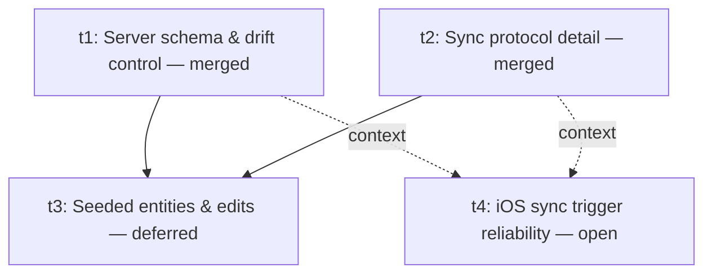

# Plan: Sync v2

## Goal

Rebuild sync from first principles. v1 (M13) tried to make the server understand the
data with a 1500-line projection function, a global ID namespace, an event log, and
custom error branches for cross-user conflicts. It has been "completely broken" through
multiple hotfixes and an in-flight redesign that still only treats symptoms. v2 starts
over with a small, opinionated design: a typed server schema mirroring the client
Drizzle schemas with per-row LWW, a single `dirty` bit per local row in place of the
outbox, idempotent push/pull RPCs, and aggressive iOS-friendly sync triggers.

The product purposes v2 must serve, in priority order:

1. **Device recovery (critical, now)** — reinstalling the app or switching devices must
   restore exercises, sessions, sets.
2. **Two-device support (low)** — last-write-wins is acceptable.
3. **Web-based stats and history (low)** — server schema is typed so SQL works day one.
4. **AI access via MCP (low)** — same SQL surface.
5. **Group functionality (future)** — layerable on the typed schema later.

The foundational sketch and revisions are in [brainstorm.md](brainstorm.md).

## Outcomes

When v2 is done (across this plan and any follow-up build plans), all of these are true:

- Reinstalling the mobile app on the same device, then logging in, restores all
  exercises, sessions, sets, gyms, tags within one minute of foreground.
- Logging in to a fresh second device, with remote data present, restores all of the
  above within the same window.
- All v1 sync code paths (`apps/mobile/src/sync/engine.ts`, `outbox.ts`, the eight
  per-entity event types, sequence counters, batch envelopes) and v1 server objects
  (`sync_apply_projection_event`, `sync_events_ingest`, `sync_device_ingest_state`,
  `sync_ingested_events`) are deleted, not coexisting.
- New `app_public.<entity>` server tables (one per client entity) exist with composite
  PK `(owner_user_id, id)`, RLS on `owner_user_id = auth.uid()`, and deferrable FKs.
  Typed columns only — no `extras jsonb` blob; deletion is expressed via `deleted_at`.
- Drift between client and server schemas is caught automatically by a quality gate
  that fails CI when a Drizzle column has no server-side counterpart (or isn't
  registered as a local-only sync column). See designs/t1.md §7 for the live spec.
- Wipe-local and wipe-remote-for-me affordances exist behind a dev gate.

This plan (the **first wave**) does *not* build any of that. It produces four design
documents that resolve open questions so that the subsequent build plan is unambiguous.

**Status (live, this wave):** t1 and t2 design docs are merged and are the
authoritative specs. t3 is deferred pending restart against merged t1+t2;
t4 is open as a restart at PR #65 (supersedes PR #59) — the simpler
scheduler model the user landed on post-t1/t2. Future agents touching any
task in this wave consume the merged design docs as the source of truth,
not the task-card bullets below (which describe the *original* ask).

## Orchestration

- Status: enabled
- Plan slug (for PR filtering): `sync-v2`
- Builder concurrency cap: 4
- Reviewer concurrency cap: unbounded
- Deviations from default protocol:
  - All four tasks in this wave are **design tasks** per `docs/operations/task-execution.md`.
    Each ships a PR landing a design doc under `docs/plans/sync-v2/designs/<task-id>.md`.
    No code or schema changes.
  - Each card includes an explicit `**Builder brief:**` block — a self-contained prompt
    the agent uses to execute. This is a layered addition to the standard card template,
    not a replacement.

## DAG

The original wave fanned all four out in parallel. After review rounds it
became clear t3 depends on t1+t2 decisions (LWW semantics, `deleted_at`
column, dirty-bit lifecycle, server-first deploy), so t3 was deferred and
will restart against the merged t1+t2 docs. t4's design is independent in
shape but consumes t1+t2 as context for its constraint indexes.

A follow-up plan (out of scope here) will consume the four design docs
and produce the build wave.

## Tasks

### t1: Server schema & drift control

> **Status: merged.** The live spec is `designs/t1.md`. The task description
> below is the original ask. Where the original ask and the merged design
> doc disagree, **the design doc wins** — notably, the `extras jsonb` blob
> was dropped during t2 reconciliation; deletion uses `deleted_at` only
> with no `deleted boolean` flag; the drift checker introspects a live
> Postgres reset, not a SQL-parser diff; and the local-only sync columns
> (`local_dirty`, `local_updated_at_ms`) are owned by t2's design, not t1.

**Problem (as originally framed):** v2 commits to a typed server schema mirroring
the client Drizzle schemas. Two failure modes need a solved design before we
build: (a) the initial migration must map 8 client tables to their server
equivalents correctly, including types, nullability, indexes, RLS, and deferrable
FKs; (b) over time, client fields will be added without server updates unless
drift detection is automatic and a future agent is reminded by the rules.

**Outcomes (as landed in `designs/t1.md`):**

- Per-entity mapping table for all eight entities (§2).
- Universal typed columns: `owner_user_id`, `client_updated_at_ms`,
  `server_received_at`, plus per-entity `deleted_at`. **No `extras jsonb`.**
- Deferrable FK declarations (§5).
- RLS policy text + immutability trigger with NULL-safe guard (§6).
- Live-DB drift checker introspecting a `supabase db reset --local` (§7), wired
  into `scripts/quality-slow.sh backend`, with trigger/policy body hashing
  (§7.3 step 4f) and topological FK order assertion (§7.7).
- Agent-reminder in `docs/specs/05-data-model.md` (§8).
- Worked example: developer adds `notes text` to `exercise_sets` (§9).

**Out of scope:** writing the migration, writing the drift-check code, editing
AGENTS.md. Only the design doc.

**Builder brief (historical):**

> You are landing a design doc, not code. Read `docs/plans/sync-v2/plan.md` and
> `docs/plans/sync-v2/brainstorm.md` first for context, then survey the current state:
>
> - Client schemas at `apps/mobile/src/data/schema/` (all 8 entity tables).
> - Current server schema in the most recent migrations under `supabase/migrations/`
>   — note especially `20260514120000_user_scoped_pk_redesign.sql` for the current
>   composite-PK shape, but understand we are **replacing** this approach, not
>   extending it.
> - `docs/specs/05-data-model.md` for any entity-level constraints you need to honour.
> - `AGENTS.md` and any always-load specs that govern schema authoring.
>
> Produce `docs/plans/sync-v2/designs/t1.md` covering every bullet under the t1
> Outcomes section in `plan.md`. The mapping table is the heart of the doc; do not
> hand-wave it. Be specific about defaults and indexes — a future builder must be able
> to write the migration from your doc with no further judgement calls.
>
> For drift detection, choose ONE concrete approach and justify it (e.g., a Node
> script that introspects Drizzle metadata + parses migration SQL, or a
> generated-schema diff). Don't propose alternatives — pick one. Specify the failure
> output and how a developer fixes it in under 5 minutes.
>
> Ship a PR titled `[t1] Sync v2 — server schema & drift control design`. The PR body
> follows the standard four-section template; the only files changed should be
> `docs/plans/sync-v2/designs/t1.md`.

---

### t2: Sync protocol detail

> **Status: merged.** The live spec is `designs/t2.md`. The task description
> below is the original ask. Several original bullets were explicitly
> overridden during review and **the design doc wins**:
>
> - **No initial-sync state machine** — no modal, no "keep local vs replace
>   local" branch. The runtime starts the scheduler on sign-in and lets
>   LWW reconcile (§5).
> - **No retry/backoff schedule** — on error the cycle returns; the next
>   scheduler tick retries naturally (§2.2 INTERNAL row).
> - **No top-level `deleted` flag on the wire** — deletion is
>   `fields.deleted_at != null`; there is no special server path (§2.1).
> - **No per-row outcomes on push success** — the response is `{ ok: true,
>   server_received_at }`; the client clears dirty for the whole sent batch
>   (§3.5).
> - **No sequence diagrams** — protocol semantics are pinned in §3, §4, §6.

**Problem (as originally framed):** The brainstorm sketched push/pull/snapshot
at one paragraph each. Before we build, every wire-level decision needs to be
pinned down: payload shape, batching rules, ordering inside a push, pagination
on pull, cursor semantics, error handling, initial sync, dirty-bit lifecycle.

**Outcomes (as landed in `designs/t2.md`):**

- Request/response JSON shapes for `sync_push` and `sync_pull` (§3.1, §4.1).
- Push topological batch builder (§3.4 — Layer 0..3 walk; single transaction
  with deferrable FKs at COMMIT).
- Pull layer-by-layer drain (§4.4 — four cursors, one per topological layer).
- "First sign-in" minimal flow (§5): scheduler starts; LWW reconciles; no
  modal, no user choice; `bootstrap_completed_at` set after all four layers
  drain.
- Dirty-bit lifecycle including push-in-flight race resolution (§7).
- Clock-monotonicity guard with synchronous-persist semantics (§8).
- Local-only sync columns: two per-entity (`local_dirty`,
  `local_updated_at_ms`) plus three singletons on `sync_runtime_state`
  (`pull_cursor`, `last_emitted_ms`, `bootstrap_completed_at`) (§9).
- Constraint reconciliation against t1 §11 and t4 §11 (§10).

**Out of scope:** implementing any of this, writing the RPC functions, UI
mocks.

**Builder brief (historical):**

> You are landing a design doc, not code. Read `docs/plans/sync-v2/plan.md` and
> `docs/plans/sync-v2/brainstorm.md` first.
>
> Survey what currently exists for context (we will delete most of it):
>
> - Client sync runtime at `apps/mobile/src/sync/` — `engine.ts`, `outbox.ts`,
>   `bootstrap.ts`, `runtime.ts`, `scheduler.ts`. Understand what each does so you
>   know what's being replaced.
> - Server side: `supabase/migrations/20260306170000_m13_sync_events_ingest_projection.sql`
>   for the v1 ingest function (do not preserve its shape — v2 is fundamentally
>   different).
> - `supabase/session-sync-api-contract.md` — v1 contract, will be rewritten.
> - `docs/tasks/fix-sync/plan.md` and `follow-ups.md` for what's broken and why.
>
> Produce `docs/plans/sync-v2/designs/t2.md` covering every bullet under t2 Outcomes
> in `plan.md`. Be exact about JSON shapes — provide example payloads. Be exact about
> the initial-sync state machine — a future builder implements your decision tree
> verbatim. For each branch, walk a concrete example.
>
> Where the brainstorm took a position (per-row vs per-aggregate, LWW on client clocks
> with monotonicity guard, etc.), confirm or override it explicitly and explain. Do
> not leave open questions; close them.
>
> Ship a PR titled `[t2] Sync v2 — protocol detail design`. Only files changed:
> `docs/plans/sync-v2/designs/t2.md`.

---

### t3: Seeded entities & user edits

> **Status: deferred — needs restart against merged t1+t2.** A draft
> exists at PR #57 (closed/draft) from before t1+t2 settled; that draft is
> a *reference*, not a starting point. The direction below incorporates
> reviewer-flagged simplifications since the original draft.

**Problem:** When a user edits a seeded exercise, what happens? Rename, delete,
two-device LWW race, app-upgrade adding new fields to seeds — all need a
worked-through answer. The mechanism must compose with t1's typed schema,
t2's wire shape, and the dirty-bit lifecycle without making the seed loader
its own special case in sync.

**Direction (as instructed during review of the original draft):**

1. **The seeder runs AFTER every sync cycle, not before.** Sequence:
   user logs in → wait for sync → apply seeder → app is ready. After
   each subsequent sync cycle the seeder re-applies so any
   server-pulled overrides stay reconciled.
2. **The seeder NEVER writes sync-relevant columns.** It does not touch
   `local_dirty` or `local_updated_at_ms`. Seed writes are
   sync-invisible.
3. **Sync ALWAYS overwrites seed data.** Server is authoritative; the
   seeder is a re-apply pass that fills in anything sync did not
   provide.
4. **All deletes are soft.** No hard-delete path; deletion sets
   `deleted_at`, period (consistent with t1's universal `deleted_at`
   column on all eight entity tables).
5. **`seed_origin` is a boolean, not a text enum.** A single bit on
   the local row distinguishes seed-origin from user-created. No
   server presence (per t1's typed-columns-only rule, this is a
   client-only column registered via `exemptions.local_only_columns`).
6. **Two-device LWW for seed renames is acceptable.** Eventually all
   devices converge on the last-writer-wins value. We do not
   encourage two-device editing as a primary use case.

**Outcomes:**

- A design doc at `designs/t3.md` covering:
  - The full lifecycle, expressed against t2's cycle model: sync runs;
    seeder re-applies; sync runs; etc. Show how this composes with t2's
    pull/push interleave (t2 §6).
  - Decision tree the seeder uses: for each seed in the bundled list,
    given local state (absent / present unmodified / present user-
    modified / soft-deleted via `deleted_at`), what does it write?
    Soft-deleted seeds must NOT be resurrected.
  - How new fields on existing seeds reach existing users: per the
    additive-merge approach, the seeder fills in any unset columns on
    existing local rows on app upgrade. It does not overwrite columns
    the user has touched (detected via dirty-bit history or
    `seed_origin = false` post-edit; pick one with reasoning).
  - Seed *removal* in a future app version: confirmed no-op (the
    bundled list is additive; absent seeds stay absent locally if they
    were already there, and don't get re-seeded if they were never
    there).
  - The `local_seed_version` integer marker — schema (singleton column
    on `sync_runtime_state` or per-entity column; pick one), when it
    is bumped, and how it gates re-application of new bundled fields.
  - The local-only `seed_origin boolean` — declared in t3's design as a
    local column with no server counterpart; registered via t1's
    `exemptions.local_only_columns` mechanism (t1 §4.1). Confirm
    placement.
  - Worked examples:
    1. User renames "Bench Press" to "My Bench", syncs, reinstalls.
    2. User deletes "Bench Press", syncs, reinstalls — stays deleted
       (the tombstone is on the server and pulls back as
       `deleted_at != null`).
    3. Two devices rename the same seed within the same minute —
       LWW picks the later `client_updated_at_ms`. Both devices
       converge.
    4. App v3 upgrade adds `default_rest_sec` to all seeds — existing
       users see the new field on their seeded rows after the next
       seeder pass, but customised seeds keep their renamed `name`.

**Out of scope:** building the loader, writing the seed bundle, implementing
the state machine.

**Builder brief:**

> You are landing a design doc, not code. **Read these in order before
> writing anything:**
>
> 1. `docs/plans/sync-v2/plan.md` — this file. The t3 task description
>    above is your spec, including the six numbered "Direction" points
>    and the Outcomes list.
> 2. `docs/plans/sync-v2/designs/t1.md` — **merged. This is authoritative**
>    for: server schema, universal `deleted_at` column, RLS, deferrable
>    FKs, drift checker, the topological FK order (§3.4.1 of t2, asserted
>    by t1 §7.7), and the `exemptions.local_only_columns` mechanism (§4.1)
>    that `seed_origin` will use.
> 3. `docs/plans/sync-v2/designs/t2.md` — **merged. This is authoritative**
>    for: the wire envelope (§2.1), push/pull RPCs (§3, §4), the
>    layer-by-layer pull (§4.4), the cycle interface (§6), the dirty-bit
>    lifecycle (§7), and the local-only column inventory (§9). t3's design
>    composes against these; it does not redefine them.
> 4. `docs/plans/sync-v2/brainstorm.md` — original positions. Confirm or
>    override explicitly.
> 5. `docs/plans/sync-v2/designs/t4.md` — the iOS trigger design.
>    Relevant for understanding *when* sync cycles fire (and therefore
>    *when* the seeder gets to re-apply).
>
> Then survey current state:
>
> - The current seed loader (`seedExerciseCatalog`) and the bundled seed
>   list under `apps/mobile/src/`.
> - `docs/tasks/fix-sync/follow-ups.md` P5 (seed version drift) for prior
>   thinking.
> - PR #57 — the deferred prior draft. Use as a reference for what was
>   considered; do not copy it. It pre-dates many of the t1/t2 decisions
>   you are now bound by.
>
> Produce `docs/plans/sync-v2/designs/t3.md`. Build the decision tree
> explicitly. The four worked examples are mandatory — walk each through
> showing every column write, including `deleted_at`, `seed_origin`, and
> (for sync-relevant rows) `local_dirty` / `local_updated_at_ms`.
>
> **Constraints emitted by t1 and t2 you MUST honour:**
>
> - All deletion is `deleted_at != null` (t1 §1.1). No `deleted boolean`
>   flag anywhere.
> - Any local-only column you introduce (e.g. `seed_origin`,
>   `local_seed_version`) must be registered in
>   `apps/mobile/src/data/schema/sync-extras.json` under
>   `exemptions.local_only_columns` (t1 §4.1).
> - The seeder MUST NOT mutate `local_dirty` or `local_updated_at_ms`
>   on any row (Direction #2; required so the dirty-bit lifecycle in
>   t2 §7 remains the sync engine's exclusive domain).
> - Seed rows that the seeder creates on a fresh install MUST eventually
>   reach the server. They are normal rows: the *first* seeder pass
>   on a fresh install dirties them like any other write; subsequent
>   seeder re-applications do not. Pick the mechanism (e.g. the seeder
>   uses the normal repo path the first time and a direct sync-invisible
>   write thereafter, gated by `seed_origin = true && local_seed_version =
>   current_bundle_version`) and document it.
>
> Ship a PR titled `[t3] Sync v2 — seeded entities & edits design`. Only
> files changed: `docs/plans/sync-v2/designs/t3.md`.

---

### t4: iOS sync trigger reliability

> **Status: open as a restart at PR #65, superseding PR #59.** The live spec is
> `designs/t4.md`. Future revisions consume t1 and t2 as authoritative
> inputs (notably the cycle interface in t2 §6 and the constraint indexes
> in t1 §11 / t2 §10 / t4 §11).
>
> The restart collapses the scheduler to one entry point (`requestSync()`,
> no `reason` parameter), two scheduling rules (1s debounce + 60s safety),
> and one authority on `online` state (NetInfo). Transport-error backoff,
> the v1 `outbox.calculateBackoffDelayMs` / `retry_blocked` path, and the
> separate immediate-cycle branches for foreground / online edges are all
> dropped. Reconnect is treated like an edit. Cycles are cheap when there's
> nothing to do, which is what justifies the simpler gating — see the
> design doc TL;DR.

**Problem:** "Frequent and reliable" syncing is platform-specific on iOS. The brainstorm
listed trigger types (debounced mutation, foreground, online event, safety interval)
but didn't engage with iOS reality: background execution is capped, network state
notifications can be unreliable in airplane-mode-recovery scenarios, app suspend/resume
can drop in-flight requests, and BGTaskScheduler has rules that bite. We need a design
that maximises sync-at-first-opportunity within the iOS lifecycle, with a clear story
about what happens in each lifecycle state.

**Outcomes:**

- A design doc at `designs/t4.md` covering:
  - iOS app lifecycle states (foreground active / inactive / background / suspended /
    terminated) and which sync trigger fires in each transition.
  - Foreground push triggers: debounced mutation (window?), on-write coalescing,
    safety interval cadence.
  - Network state: which Expo / React Native API to use (NetInfo, etc.), known
    pitfalls (delayed events after airplane mode toggle, captive portal), and how to
    handle ambiguity ("seemingly online but requests fail").
  - Background sync options:
    - `BGAppRefreshTask` (short, frequent, opportunistic) — when iOS grants it, what
      the budget is in practice, how to register it via Expo config plugins.
    - `BGProcessingTask` (longer, less frequent) — whether we need it for sync v2 or
      can stay on `BGAppRefreshTask`.
    - Whether silent push notifications are worth pursuing for "remote changes
      available; please pull" signalling (likely not for purpose #2 low-priority, but
      called out).
  - Concrete recommendation: which background mechanism, registered via which Expo
    plugin or native module, and what the registration block looks like in
    `app.config.ts` / Info.plist.
  - In-flight request behaviour: if the app suspends mid-push, what the client does on
    resume (retry from dirty bits — explain why this is correct).
  - "Sync now" UX: where the button lives (Settings → Sync), what it does (force
    push then pull regardless of cadence), what feedback the user gets.
  - Sync status surface: what the user sees in Settings (last successful sync time,
    dirty count, error state, network state). This builds on v1's `profile-status.ts`
    — confirm what changes.
  - Battery / data tradeoffs: a brief honest section. v2 default cadence costs
    ~X requests/hour while foreground; quantify.
  - Testability: how do we verify sync triggers fire correctly? Maestro flows or
    other automated tests, and what they assert.

**Out of scope:** Android (deferred — current product is iOS-only via TestFlight per
`com.phano.boga3.dev`), writing config plugins, implementing the background task.

**Builder brief:**

> You are landing a design doc, not code. **Read these in order before
> writing anything:**
>
> 1. `docs/plans/sync-v2/plan.md` — this file.
> 2. `docs/plans/sync-v2/designs/t1.md` — **merged. Authoritative** for
>    server schema and the drift contract t4's BG-task config must
>    honour (notably the migration-in-flight contract in §1).
> 3. `docs/plans/sync-v2/designs/t2.md` — **merged. Authoritative** for
>    the cycle interface t4's scheduler invokes (§6), the surviving-
>    state contract (§7, §9), and the constraint index t4's §11 walks
>    against.
> 4. `docs/plans/sync-v2/brainstorm.md`.
>
> Then survey:
>
> - Current scheduler at `apps/mobile/src/sync/scheduler.ts` (foreground cadence, online
>   toggling).
> - Current sync status surface at `apps/mobile/src/sync/profile-status.ts` and
>   wherever Settings consumes it.
> - `apps/mobile/app.config.ts` — what background modes are declared, what
>   Expo plugins are active.
> - Expo / React Native documentation for `BGTaskScheduler`. Use the
>   context7 MCP for current Expo docs rather than relying on training data.
>
> Produce `docs/plans/sync-v2/designs/t4.md` covering every bullet under
> t4 Outcomes. Be specific about iOS budgets and constraints — quote
> Apple's posted rules where relevant.
>
> Pick exactly one background sync mechanism and justify the choice; do
> not present alternatives without picking. Include the literal
> `app.config.ts` plugin block (or JSON snippet) a future builder will
> copy.
>
> Note the project rules: no `__DEV__` global per the user's memory, and
> dev-only behaviour must be gated by `isDevMode()` so it survives the
> TestFlight dev build. Any dev-only sync affordances should follow this.
>
> Ship a PR titled `[t4] Sync v2 — iOS trigger reliability design`. Only
> files changed: `docs/plans/sync-v2/designs/t4.md`.

## Deviations log

- **t1 (PR #58, merged):** `extras jsonb` universal column dropped during
  review rounds. The original ask in this plan referenced an `extras`
  forward-compat hatch (Outcomes section + t1 Outcomes bullets); the
  design landed without it. Server-first deploy is now the unconditional
  rule. Downstream: t2's wire envelope dropped `extras`, t3's seeded-
  entity design now uses local-only columns via the same `local_only`
  exemption mechanism.
- **t1 (PR #63, merged):** reconciliation with t2 added `deleted_at` to
  the two join tables (`exercise_muscle_mappings`,
  `session_exercise_tags`), so all eight entity tables now carry a
  uniform tombstone marker. The `deleted boolean` universal column was
  dropped. Drift checker (§7.7) extended to assert the topological FK
  order t2's push batch builder depends on.
- **t2 (PR #60, merged):** several original Outcomes bullets explicitly
  overridden — initial-sync state machine dropped (no modal, no "keep
  local vs replace local" branch); retry/backoff schedule dropped (on
  error the cycle returns and the next scheduler tick retries); top-
  level `deleted` flag never landed (deletion is `deleted_at != null`);
  per-row push outcomes collapsed to a single `{ ok: true }` ack;
  sequence diagrams dropped. The merged `designs/t2.md` is the live
  spec.
- **t3 (PR #57, deferred):** the original draft pre-dated t1/t2's
  settling. Deferred for restart against merged t1+t2; the t3 task
  card in this plan was rewritten with the user-instructed direction
  changes (seeder runs after sync, sync overwrites seed data, soft-
  delete only, `seed_origin` as boolean, two-device LWW acceptable).
- **t4 (PR #59, superseded):** went through two review rounds. The original
  Outcomes bullet about retry/backoff was dropped (matches t2's
  no-backoff posture); the sync cycle interface (§6 of t2) is now the
  authoritative contract t4's scheduler invokes; battery quantification
  flagged a follow-up to collapse idle pulls. PR #59 is now superseded
  by the PR #65 restart and will be closed when #65 merges.
- **t4 (PR #65, open):** restart against the simpler scheduler model the
  user landed on after t1+t2 settled. Single `requestSync()` entry point
  (no `reason` parameter); two scheduling rules (1s debounce + 60s
  safety); the foreground / online / manual triggers all take the
  debounce path (no special "immediate cycle" branches); transport-error
  backoff / `retry_blocked` / `nextAttemptAt` bookkeeping all dropped;
  NetInfo is the sole authority on `online` state. The four t2 constraints
  in §11 are unchanged from PR #59 and remain honoured by merged t2
  §6/§7/§9. The `profile-status.ts` diff now drops the `retry_scheduled`
  kind (no backoff state surface to render).
