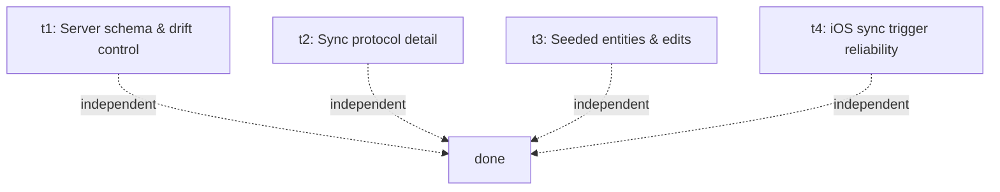

# Plan: Sync v2

## Goal

Rebuild sync from first principles. v1 (M13) tried to make the server understand the
data with a 1500-line projection function, a global ID namespace, an event log, and
custom error branches for cross-user conflicts. It has been "completely broken" through
multiple hotfixes and an in-flight redesign that still only treats symptoms. v2 starts
over with a small, opinionated design: a typed server schema mirroring the client
Drizzle schemas with per-row LWW, a single `dirty` bit per local row in place of the
outbox, idempotent push/pull RPCs, and aggressive iOS-friendly sync triggers.

The product purposes v2 must serve, in priority order:

1. **Device recovery (critical, now)** — reinstalling the app or switching devices must
   restore exercises, sessions, sets.
2. **Two-device support (low)** — last-write-wins is acceptable.
3. **Web-based stats and history (low)** — server schema is typed so SQL works day one.
4. **AI access via MCP (low)** — same SQL surface.
5. **Group functionality (future)** — layerable on the typed schema later.

The foundational sketch and revisions are in [brainstorm.md](brainstorm.md).

## Outcomes

When v2 is done (across this plan and any follow-up build plans), all of these are true:

- Reinstalling the mobile app on the same device, then logging in, restores all
  exercises, sessions, sets, gyms, tags within one minute of foreground.
- Logging in to a fresh second device, with remote data present, restores all of the
  above within the same window.
- All v1 sync code paths (`apps/mobile/src/sync/engine.ts`, `outbox.ts`, the eight
  per-entity event types, sequence counters, batch envelopes) and v1 server objects
  (`sync_apply_projection_event`, `sync_events_ingest`, `sync_device_ingest_state`,
  `sync_ingested_events`) are deleted, not coexisting.
- New `app_public.<entity>` server tables (one per client entity) exist with composite
  PK `(owner_user_id, id)`, RLS on `owner_user_id = auth.uid()`, deferrable FKs, and
  `extras jsonb` for forward-compat.
- Drift between client and server schemas is caught automatically by a quality gate
  that fails CI when a Drizzle column has no server-side counterpart (or isn't declared
  as extras-only).
- Wipe-local and wipe-remote-for-me affordances exist behind a dev gate.

This plan (the **first wave**) does *not* build any of that. It produces four design
documents that resolve open questions so that the subsequent build plan is unambiguous.

## Orchestration

- Status: enabled
- Plan slug (for PR filtering): `sync-v2`
- Builder concurrency cap: 4
- Reviewer concurrency cap: unbounded
- Deviations from default protocol:
  - All four tasks in this wave are **design tasks** per `docs/operations/task-execution.md`.
    Each ships a PR landing a design doc under `docs/plans/sync-v2/designs/<task-id>.md`.
    No code or schema changes.
  - Each card includes an explicit `**Builder brief:**` block — a self-contained prompt
    the agent uses to execute. This is a layered addition to the standard card template,
    not a replacement.

## DAG

All four design tasks are independent and run in parallel. A follow-up plan (out of
scope here) will consume the four design docs and produce the build wave.

## Tasks

### t1: Server schema & drift control

**Problem:** v2 commits to a typed server schema mirroring the client Drizzle schemas
(per [brainstorm.md](brainstorm.md) discussion outcomes). Two failure modes need a
solved design before we build: (a) the initial migration must map 8 client tables to
their server equivalents correctly, including types, nullability, indexes, RLS, and
deferrable FKs; (b) over time, client fields will be added without server updates
unless drift detection is automatic and a future agent is reminded by the rules. The
v1 sync failed in part because nothing forced consistency between layers.

**Outcomes:**

- A design doc at `designs/t1.md` covering:
  - Per-entity mapping table: client Drizzle column → server Postgres column (type,
    nullable, default, indexed, FK target if any). All eight entities:
    `gyms`, `sessions`, `session_exercises`, `exercise_sets`, `exercise_definitions`,
    `exercise_muscle_mappings`, `exercise_tag_definitions`, `session_exercise_tags`.
  - The `extras jsonb` column convention: when client writes a known field vs an
    unknown field, how server reads it, how it gets promoted to a real column later.
  - The two new local columns (`local_dirty boolean`, `local_updated_at_ms bigint`) on
    each client table — purpose, defaults, where they're set and cleared.
  - Local schema additions for entities that currently lack a `deletedAt` column
    (`gyms`, `session_exercises`, `exercise_sets` per fix-sync follow-up P4).
  - Deferrable FK declarations: which FKs, what `INITIALLY DEFERRED` means in practice
    for push transactions, what happens when a child row arrives with no parent.
  - RLS policy text for each table.
  - Drift-detection mechanism: a runnable check (script or test) that diffs the client
    Drizzle schema against the server migration tree and fails if a typed client column
    has neither a typed server column nor an `extras_only` allowlist entry. Specify
    where it lives, what command runs it, and how it wires into
    `scripts/quality-slow.sh backend` (or fast, justify).
  - Agent-reminder mechanism: which AGENTS.md / spec file gets an instruction that
    "modifying any file under `apps/mobile/src/data/schema/` requires a paired server
    migration or extras-only registration." Write the exact wording.
  - One worked example: walking through "developer adds `notes text` to
    `exercise_sets`" and what the workflow looks like from the developer's
    perspective.

**Out of scope:** writing the migration, writing the drift-check code, editing
AGENTS.md. Only the design doc.

**Builder brief:**

> You are landing a design doc, not code. Read `docs/plans/sync-v2/plan.md` and
> `docs/plans/sync-v2/brainstorm.md` first for context, then survey the current state:
>
> - Client schemas at `apps/mobile/src/data/schema/` (all 8 entity tables).
> - Current server schema in the most recent migrations under `supabase/migrations/`
>   — note especially `20260514120000_user_scoped_pk_redesign.sql` for the current
>   composite-PK shape, but understand we are **replacing** this approach, not
>   extending it.
> - `docs/specs/05-data-model.md` for any entity-level constraints you need to honour.
> - `AGENTS.md` and any always-load specs that govern schema authoring.
>
> Produce `docs/plans/sync-v2/designs/t1.md` covering every bullet under the t1
> Outcomes section in `plan.md`. The mapping table is the heart of the doc; do not
> hand-wave it. Be specific about defaults and indexes — a future builder must be able
> to write the migration from your doc with no further judgement calls.
>
> For drift detection, choose ONE concrete approach and justify it (e.g., a Node
> script that introspects Drizzle metadata + parses migration SQL, or a
> generated-schema diff). Don't propose alternatives — pick one. Specify the failure
> output and how a developer fixes it in under 5 minutes.
>
> Ship a PR titled `[t1] Sync v2 — server schema & drift control design`. The PR body
> follows the standard four-section template; the only files changed should be
> `docs/plans/sync-v2/designs/t1.md`.

---

### t2: Sync protocol detail

**Problem:** The brainstorm sketched push/pull/snapshot at one paragraph each. Before we
build, we need every wire-level decision pinned down: payload shape, batching rules,
ordering inside a push (so deferrable FKs commit cleanly), pagination on pull, cursor
semantics, error handling per row vs per batch, what "initial sync" looks like for a
user who already has both local and remote data, and how the client decides when local
counts as "has edits." This is the doc the build task literally implements.

**Outcomes:**

- A design doc at `designs/t2.md` covering:
  - Exact request/response shapes for `sync.push` and `sync.pull` (JSON schemas).
  - Whether push entities go in topological order or arbitrary order, and what the
    server does to make deferrable FKs commit (single transaction per request, FKs
    deferred, commit at end). Specify what happens when a single bad row would fail
    the batch — whole-batch reject or partial accept.
  - Aggregate grouping rule: does a push batch need to include a Session's children to
    succeed, or are detached children acceptable (e.g., set written while session not
    yet pushed)?
  - Per-row outcome reporting: what the response says so the client knows which dirty
    bits to clear.
  - Pull pagination: cursor semantics (`server_received_at` monotonicity, how to handle
    same-millisecond rows, tiebreak with `(owner, type, id)`).
  - Initial-sync state machine — three branches (local empty / remote empty,
    local-only, remote-only, both-have-data) and what the client does in each. Spell
    out the UX modal copy for "Keep local and merge with cloud" vs "Replace local with
    cloud." Define "has local data" precisely (is it `count(*) > 0` per table, is it
    a `dirty=true` row, is it a profile flag?).
  - Dirty-bit lifecycle in detail: when set by repos (every write path), when cleared
    (after acked push), what happens when a row is mutated while a push for it is
    in flight.
  - Clock-monotonicity guard: `local_updated_at_ms = max(Date.now(), last_emitted + 1)`
    — where it lives, how it's persisted across app restarts.
  - Retry / backoff: exponential schedule (initial, multiplier, cap), what resets it,
    what happens if the device goes offline mid-push.
  - Tombstone handling: what `deleted=true` means on the wire, what pull returns for
    deleted rows, how the client applies tombstones.
  - Concrete sequence diagrams for: (a) device-reinstall login, (b) two devices both
    online editing same row.

**Out of scope:** implementing any of this, writing the RPC functions, drawing UI
mocks for the modal beyond copy.

**Builder brief:**

> You are landing a design doc, not code. Read `docs/plans/sync-v2/plan.md` and
> `docs/plans/sync-v2/brainstorm.md` first.
>
> Survey what currently exists for context (we will delete most of it):
>
> - Client sync runtime at `apps/mobile/src/sync/` — `engine.ts`, `outbox.ts`,
>   `bootstrap.ts`, `runtime.ts`, `scheduler.ts`. Understand what each does so you
>   know what's being replaced.
> - Server side: `supabase/migrations/20260306170000_m13_sync_events_ingest_projection.sql`
>   for the v1 ingest function (do not preserve its shape — v2 is fundamentally
>   different).
> - `supabase/session-sync-api-contract.md` — v1 contract, will be rewritten.
> - `docs/tasks/fix-sync/plan.md` and `follow-ups.md` for what's broken and why.
>
> Produce `docs/plans/sync-v2/designs/t2.md` covering every bullet under t2 Outcomes
> in `plan.md`. Be exact about JSON shapes — provide example payloads. Be exact about
> the initial-sync state machine — a future builder implements your decision tree
> verbatim. For each branch, walk a concrete example.
>
> Where the brainstorm took a position (per-row vs per-aggregate, LWW on client clocks
> with monotonicity guard, etc.), confirm or override it explicitly and explain. Do
> not leave open questions; close them.
>
> Ship a PR titled `[t2] Sync v2 — protocol detail design`. Only files changed:
> `docs/plans/sync-v2/designs/t2.md`.

---

### t3: Seeded entities & user edits

**Problem:** The brainstorm settled on fixed slug IDs (`seed:bench-press`) and an
idempotent loader. But the genuinely hard case wasn't worked through: **what happens
when a user edits a seeded exercise?** Examples to resolve: user renames "Bench Press"
to "My Bench" — does the rename roundtrip through sync correctly? Two devices each
rename the same seed differently — does LWW pick the right one? User deletes a seeded
exercise — does it stay deleted across reinstall, or does the seed loader resurrect
it? Seeded exercise gets new fields in an app update (e.g., a `defaultRestSec`) — do
they reach existing users who already own that seed?

**Outcomes:**

- A design doc at `designs/t3.md` covering:
  - The full lifecycle of a seeded entity: install → user edit → sync → reinstall →
    re-seed attempt → conflict resolution. State machine or sequence diagrams.
  - Decision tree the seed loader uses: for each seed in the bundled list, given local
    state (present / absent / soft-deleted / present-but-modified), what does it do?
  - Whether seed *deletion* is preserved across reinstall. Specifically: if the seed
    loader sees `seed:bench-press` is absent locally because the user deleted it, does
    it re-seed (no), and how does it know the difference between "deleted by user" and
    "fresh install"? Likely answer: re-seeding only happens when the local DB is empty
    of all entities (true fresh install); after first sync the loader trusts that any
    absent seed was deleted intentionally. Confirm or override.
  - How new fields on existing seeds reach existing users. Two candidate approaches:
    (a) seed loader merges new bundled fields into existing local rows on app upgrade,
    (b) new fields only apply to fresh installs and existing users keep their pre-
    upgrade values. Pick one with reasoning. Whatever the choice, it must not silently
    overwrite a user's customisation (renamed "My Bench").
  - Seed *removal* in a future app version: if v3 ships without `seed:bench-press` but
    the user has it locally, what happens? Likely: nothing — bundled list is additive
    only; removal is a no-op. Confirm.
  - The `default_seed_version` integer or similar marker stored locally to track which
    bundle version was last applied — schema, where it lives, when it's bumped.
  - How seeded vs user-created is distinguished (or not) in the data model. Per the
    brainstorm: not at all on the server, and locally only via the slug prefix. Confirm
    or propose a `seed_origin text` column on the local table (no server presence).
  - Worked examples (sequence diagrams or numbered steps):
    1. User installs app, renames Bench Press, syncs, reinstalls — what they see.
    2. User installs app, deletes Bench Press, syncs, reinstalls — what they see.
    3. Two devices both rename the same seed within the same minute — LWW outcome.
    4. App upgrade adds `defaultRestSec` to all seeds — what existing user sees.

**Out of scope:** building the loader, writing the seed bundle, implementing the
state machine.

**Builder brief:**

> You are landing a design doc, not code. Read `docs/plans/sync-v2/plan.md` and
> `docs/plans/sync-v2/brainstorm.md` first.
>
> Survey current state:
>
> - The current seed loader (renamed to `seedExerciseCatalog` per fix-sync T6 / `seedSystemExerciseCatalog`
>   pre-rename). Find it under `apps/mobile/src/` and read it end-to-end.
> - The current seed list / bundled definitions — find where the seed data lives.
> - `docs/tasks/fix-sync/follow-ups.md` P5 (seed version drift) and the seed-survival
>   work in T4 of fix-sync, for current thinking.
>
> Produce `docs/plans/sync-v2/designs/t3.md` covering every bullet under t3 Outcomes
> in `plan.md`. Build the decision tree explicitly: a table or flowchart with one row
> per (local-state, seed-loader-result) pair. The four worked examples are mandatory
> — walk through them step by step, including which entities are written/updated and
> what `local_dirty` / `local_updated_at_ms` end up as.
>
> Where the brainstorm took a position (fixed slug IDs, idempotent loader), confirm
> or override it with reasoning. The interesting case the user explicitly flagged is
> user-edited seeds — give that case extra weight in the design.
>
> Ship a PR titled `[t3] Sync v2 — seeded entities & edits design`. Only files
> changed: `docs/plans/sync-v2/designs/t3.md`.

---

### t4: iOS sync trigger reliability

**Problem:** "Frequent and reliable" syncing is platform-specific on iOS. The brainstorm
listed trigger types (debounced mutation, foreground, online event, safety interval)
but didn't engage with iOS reality: background execution is capped, network state
notifications can be unreliable in airplane-mode-recovery scenarios, app suspend/resume
can drop in-flight requests, and BGTaskScheduler has rules that bite. We need a design
that maximises sync-at-first-opportunity within the iOS lifecycle, with a clear story
about what happens in each lifecycle state.

**Outcomes:**

- A design doc at `designs/t4.md` covering:
  - iOS app lifecycle states (foreground active / inactive / background / suspended /
    terminated) and which sync trigger fires in each transition.
  - Foreground push triggers: debounced mutation (window?), on-write coalescing,
    safety interval cadence.
  - Network state: which Expo / React Native API to use (NetInfo, etc.), known
    pitfalls (delayed events after airplane mode toggle, captive portal), and how to
    handle ambiguity ("seemingly online but requests fail").
  - Background sync options:
    - `BGAppRefreshTask` (short, frequent, opportunistic) — when iOS grants it, what
      the budget is in practice, how to register it via Expo config plugins.
    - `BGProcessingTask` (longer, less frequent) — whether we need it for sync v2 or
      can stay on `BGAppRefreshTask`.
    - Whether silent push notifications are worth pursuing for "remote changes
      available; please pull" signalling (likely not for purpose #2 low-priority, but
      called out).
  - Concrete recommendation: which background mechanism, registered via which Expo
    plugin or native module, and what the registration block looks like in
    `app.config.ts` / Info.plist.
  - In-flight request behaviour: if the app suspends mid-push, what the client does on
    resume (retry from dirty bits — explain why this is correct).
  - "Sync now" UX: where the button lives (Settings → Sync), what it does (force
    push then pull regardless of cadence), what feedback the user gets.
  - Sync status surface: what the user sees in Settings (last successful sync time,
    dirty count, error state, network state). This builds on v1's `profile-status.ts`
    — confirm what changes.
  - Battery / data tradeoffs: a brief honest section. v2 default cadence costs
    ~X requests/hour while foreground; quantify.
  - Testability: how do we verify sync triggers fire correctly? Maestro flows or
    other automated tests, and what they assert.

**Out of scope:** Android (deferred — current product is iOS-only via TestFlight per
`com.phano.boga3.dev`), writing config plugins, implementing the background task.

**Builder brief:**

> You are landing a design doc, not code. Read `docs/plans/sync-v2/plan.md` and
> `docs/plans/sync-v2/brainstorm.md` first.
>
> Survey:
>
> - Current scheduler at `apps/mobile/src/sync/scheduler.ts` (foreground cadence, online
>   toggling). Understand what it does today.
> - Current sync status surface at `apps/mobile/src/sync/profile-status.ts` and
>   wherever Settings consumes it.
> - `apps/mobile/app.config.ts` and any `app.json` — what background modes are
>   declared, what Expo plugins are active.
> - Expo / React Native documentation for `BGTaskScheduler` integration. Use the
>   context7 MCP for current Expo docs rather than relying on training data.
>
> Produce `docs/plans/sync-v2/designs/t4.md` covering every bullet under t4 Outcomes
> in `plan.md`. Be specific about iOS budgets and constraints — quote Apple's posted
> rules where relevant.
>
> Pick exactly one background sync mechanism and justify the choice; do not present
> alternatives without picking. Include the literal `app.config.ts` plugin block (or
> JSON snippet) a future builder will copy.
>
> Note the project rules: no `__DEV__` global per the user's memory, and dev-only
> behaviour must be gated by `isDevMode()` so it survives the TestFlight dev build.
> Any dev-only sync affordances (like a tight 5s safety interval) should follow this.
>
> Ship a PR titled `[t4] Sync v2 — iOS trigger reliability design`. Only files
> changed: `docs/plans/sync-v2/designs/t4.md`.

## Deviations log

_(empty until first merge)_
