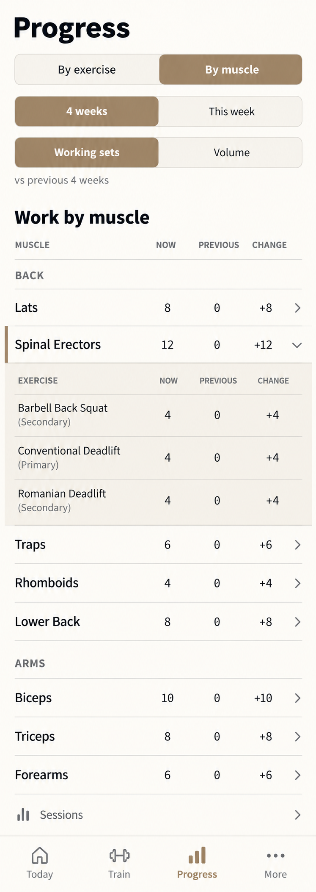

# T-20261006-01 — Correct Progress layout to the selected proposal

- Status: `planned`
- Depends on: none
- Milestone: none
- Areas: frontend, docs; UI impact: yes
- Delivery: one implementation session, one local worktree, one PR

## Objective

Correct only the Progress page layout so it matches the better-looking continuous-table proposal selected by the operator. Preserve the current Progress data, calculations, routes, history surfaces, charts and preferences; this task changes presentation and the existing contribution disclosure layout, not product semantics.

## Accepted design target

The image below is the accepted layout target. It was regenerated on 2026-10-06 from the archived prompt for the previously selected Product Design option 3 after the original generated file was not retained. The operator authorized the regeneration and verbally amended the image authority as recorded below.

The image governs visual hierarchy, spacing and the continuous inline contribution treatment. Repository tokens, accessibility contracts, responsive rules and real data remain authoritative. The written decisions below override any ambiguous illustrative detail.

## Scope

- In:
  - the Progress page's control hierarchy, muscle table spacing and contribution-block presentation;
  - the existing one-open-at-a-time chevron disclosure;
  - normal, non-underlined muscle and contribution names while retaining their separate history actions;
  - removal of the visible contribution Total/subtotal row;
  - responsive layout and native screenshot comparison against the accepted image;
  - meaningful Jest coverage and updates to the owning Progress design target.
- Out:
  - Progress calculations, aggregation, period bounds, comparison values or reconciliation rules;
  - local schema, sync, backend, authentication or group behavior;
  - Daily/Weekly charts, history PageSheet layout, history selection or dismissal;
  - exercise browsing/search/sort behavior, Sessions navigation or bottom-tab behavior;
  - new metrics, preferences, colour roles, typography tokens or reusable primitives;
  - a new committed Maestro scenario unless separately justified and approved.

## Decided

1. Keep the current interaction model: zero or one muscle detail block is open. A collapsed chevron points right; pressing it opens that muscle's details directly beneath its row and changes the chevron to down. Pressing the down chevron collapses it. Opening another muscle closes the previous one.
2. Details are visually attached to their muscle: the contribution block follows immediately after the selected muscle row, before the next muscle or family. Do not render a detached section or large contribution heading, and do not jump the scroll position when disclosure changes.
3. Use the selected continuous-table treatment: a subtle warm surface tint across the full contribution block, bounded by quiet top and bottom hairlines. No card, shadow, floating container or excessive gap.
4. Muscle names and contribution exercise names remain separate history actions from the chevrons. Per the operator's verbal amendment, names use normal text with no underline or underscore character. Preserve link semantics, accessibility labels, 44pt targets and focus restoration without relying on underlining.
5. Remove the visible contribution Total/subtotal row shown by the current implementation. This is presentation-only: the implementation and tests still prove that contributor values reconcile with the parent muscle row in both periods and both metrics.
6. Keep the pinned `By Exercise / By Muscle` switch, period and metric controls, comparison wording, current target-attainment shading, full taxonomy, Sessions link and fixed tabs. Do not reintroduce `Browse exercises`.
7. Keep current responsive fallbacks for long names, large figures and incomplete Volume. Full figures remain readable and aligned; no horizontal table scrolling or clipped content.
8. Do not redesign surrounding Progress history or charts to imitate contextual content in the image.

## Implementation approach

1. Start from latest `origin/main`; load the current Progress route, `components/stats/progress-tables.tsx`, the owning UI specs and `apps/mobile/__tests__/README.md`.
2. Refine the existing contribution container and row styles rather than building a parallel table. Remove the rendered Total row while retaining reconciliation data and assertions.
3. Remove visual underlines from muscle and contribution names without merging the history and disclosure press targets or weakening accessibility semantics.
4. Preserve the existing nullable selected-muscle state and its right/down chevron behavior. Add or update Jest assertions for one-open-at-a-time replacement, repeat-tap collapse, independent history actions, no underline and no visible Total.
5. Render representative real-data states on small and large iPhones and compare them with the target: default muscle table, one expanded muscle, another muscle replacing it, collapsed state, Working sets, Volume/incomplete coverage, long names and Sessions at the end.

## Deliverables and acceptance

1. The Progress page matches the target's hierarchy and density while using production tokens and real data.
2. A contribution block reads as one continuous part of its muscle row: subtle warm tint, quiet hairlines, no card/shadow, no detached heading and no visible Total/subtotal.
3. Closed chevrons point right; the open chevron points down; pressing it again closes the block; opening another replaces it. At most one contribution block is visible.
4. Muscle and exercise names use normal non-underlined text, still open the correct history target, and never toggle contribution disclosure.
5. Period, metric, exercise view, search/sort, Sessions, history, charts, calculations, coverage wording and target shading behave exactly as before.
6. Small and large phone captures are compared with this image; material differences and intentional repository-token adaptations are recorded in the implementation PR.
7. The shipping PR moves this accepted image into `docs/specs/ui/design-targets/progress-tables/`, updates the durable target to supersede the older layout image, and deletes this card and its planning asset.

## UX contract

| Flow | Trigger and steps | Success | Failure / edge |
| --- | --- | --- | --- |
| Inspect contributions | Press a muscle's right chevron | Its details open immediately beneath it; chevron points down; no detached section or Total row | Successful no-contributor reads retain metric-specific empty copy |
| Collapse details | Press the selected muscle's down chevron | The inline block closes and the chevron returns right | Focus stays on the disclosure control; no scroll jump |
| Replace details | Open one muscle, then another | The previous block closes and only the new muscle's block appears | Superseded reads cannot publish under the new muscle |
| Open history | Press a normal, non-underlined muscle or exercise name | Existing history opens for that item; disclosure state is unchanged | History failure stays inline and retryable; the chevron is never triggered |
| Change period or metric | Change a control with details open | Current data and coverage rules update; layout remains attached and readable | Loading/error behavior and zero/unknown distinctions remain unchanged |
| Browse the page | Switch views and reach Sessions | Existing exercise view and Sessions navigation remain available | Long names, large figures and incomplete Volume do not clip or scroll horizontally |

## Specs to update when implementation ships

- `docs/specs/ui/design-targets/progress-tables.md` — replace the old visual authority with this accepted continuous-table layout and the no-underline amendment.
- `docs/specs/ui/design-language.md` or `docs/specs/ui/ux-rules.md` only if a cross-screen rule genuinely changes; this task is expected to remain Progress-specific.
- `docs/specs/ui/components-catalog.md` only if component selection or ownership changes; styling an existing Progress component does not require a catalog change.

## Gates

`./boga test for` on the finished implementation diff is authoritative. Before running any lane beyond `./boga test fast`, propose the smallest device set to the operator.

Expected implementation evidence:

| Command / evidence | Purpose |
| --- | --- |
| `./boga test fast` | Required Jest and fast gates; add/update Jest coverage for the changed presentation contract |
| `./boga test ios-data-smoke` (proposed) | Existing Progress device journey and on-device SQLite rendering; operator must agree to this narrowing or choose `frontend-ui` |
| `./boga test jest-coverage` | Whole-suite coverage target before the PR |
| `./boga test complexity` | Complexity target before the PR |
| `./boga test dependencies` | Import-direction and cycle target before the PR |
| Native 375pt/430pt captures | Direct comparison with the accepted layout target |

Do not add a Maestro flow for styling alone. If implementation reveals a device-only interaction claim that Jest cannot prove, explain it and obtain operator approval before adding a scenario.
