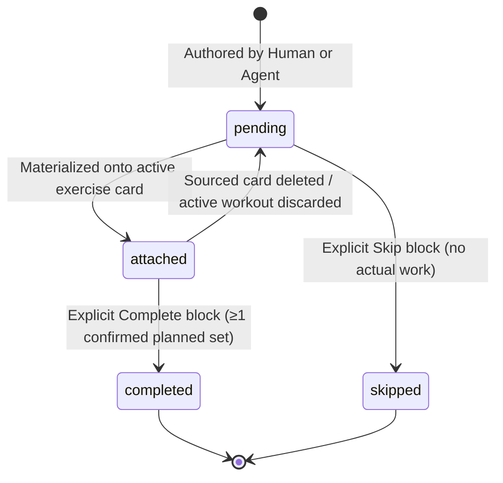

# Session Planning and Programmes Technical Contract

Load when you are building or changing authored plans and programmes: their
schema, the Sync v2 16-entity expansion, materialization onto performed rows,
block lifecycle, set reordering, or the agent plan-write API and MCP tools.

## 1. Architectural Decisions and Principles

1. **Blueprint vs performed.** Plans and programmes are authored intent, never
   live workout state; `sessions.status` stays strictly `active | completed`.
   Plan and programme rows are excluded from performed history, volume
   analytics, personal records and group activity feeds — only materialized rows
   confirmed in the performed graph count.
2. **Materialization uses standard entities.** Starting a plan or consuming a
   block creates ordinary `session_exercises` and `exercise_sets` rows. There is
   no recorder "planning mode", so draft and autosave mechanics are unchanged.
3. **The exercise block is the unit of consumption and progress.** A
   `session_plan_exercises` row plus its ordered `session_plan_sets` is
   independently consumable: a user can attach one block (e.g. the squat block of
   a 6-week wave) to an active session, perform unrelated freeform exercises, and
   explicitly resolve only that block.
4. **Deterministic provenance and partial uniqueness.** Performed rows link back
   to source plan rows via nullable FKs (§2.2), and partial unique indexes allow
   at most one live performed session per whole-plan start, one live card per plan
   block, and one live set per plan target set — so retries, multi-device sync and
   concurrent attachments converge deterministically (§4.5).
5. **Set reordering invariant.** Performed sets reorder freely inside a card by
   mutating only `exercise_sets.order_index`; reordering never alters source-plan
   target order, row identities, or `source_plan_set_id`.
6. **Agent permissions are separate and opt-in.** The base Supabase OAuth grant
   stays strictly read-only. Coaching agents read upcoming plans and create new
   plans/programmes only under explicit per-client permission in
   `public.agent_plan_permissions`; they can never edit or delete plans, start
   workouts, or mutate performed history.
7. **Exhaustive coaching reads.** Coaching history reads drain qualifying history
   via stable keyset cursors to exhaustion. Silent row caps and unpaginated
   truncation are prohibited.

## 2. Data Model and Schema

### 2.1 Synced Entity Tables (Sync v2)

Four entities, all user-owned, composite-keyed `(owner_user_id, id)` with ULID
`id`, carrying the standard Sync v2 server fields plus client
`createdAt` / `updatedAt` / `deletedAt` epoch-ms columns; foreign keys are
`DEFERRABLE INITIALLY DEFERRED`.
Every composite FK below is `(owner_user_id, <col>) -> <parent>(owner_user_id,
id)`; camelCase ↔ snake_case mapping follows `apps/mobile/src/data/schema/`.

**`training_programmes`** — an ordered collection of planned sessions (a 6-week
wave, a split): `name` required 1..100 chars, `description` nullable max 500.

**`session_plans`** — one authored future session, standalone or in a programme.

- `programme_id` — nullable FK → `training_programmes`, `ON DELETE SET NULL`
- `programme_order_index` — nullable, 0-based order within the programme
- `gym_id` — nullable FK → `gyms`, `ON DELETE SET NULL`
- `title` — required, 1..100 chars
- `scheduled_for` — nullable epoch ms; null means the unscheduled queue
- `provenance` — `'human' | 'agent'`, default `'human'`

**`session_plan_exercises`** — an ordered, independently consumable block.

- `session_plan_id` — FK → `session_plans`, `ON DELETE CASCADE`
- `exercise_definition_id` — nullable FK → `exercise_definitions`,
  `ON DELETE SET NULL`
- `order_index` — 0-based dense sequence within the plan
- `name` / `machine_name` — exercise and equipment name snapshots; `name`
  required 1..100 chars
- `progress_status` — `'pending' | 'completed' | 'skipped'`, default
  `'pending'`, `CHECK`-constrained
- `resolved_at` — nullable;
  `CHECK (resolved_at IS NULL OR progress_status IN ('completed','skipped'))`

**`session_plan_sets`** — an ordered target set for a planned block.

- `session_plan_exercise_id` — FK → `session_plan_exercises`,
  `ON DELETE CASCADE`
- `order_index` — 0-based dense sequence within the block
- `target_weight_value` — nullable non-negative numeric text in kg; null means
  "choose during workout"
- `target_reps` — required positive integer, `CHECK (target_reps > 0)`
- `target_set_type` — nullable standard set type (`'work'`, `'warm_up'`,
  `'rir_1'`, …)

### 2.2 Performed-Domain Provenance Fields

Three nullable `text` columns added to the existing performed tables. Each is a
composite FK `ON DELETE SET NULL DEFERRABLE INITIALLY DEFERRED`, guarded by a
partial unique index on `(owner_user_id, <col>) WHERE deleted_at IS NULL AND
<col> IS NOT NULL`.

| Column | Parent | Partial unique index | Null when |
| :--- | :--- | :--- | :--- |
| `sessions.source_plan_id` | `session_plans` | `sessions_owner_source_plan_unique` | set only on whole-plan starts (`startSessionPlan`); null for manual sessions and single-block attachment |
| `session_exercises.source_plan_exercise_id` | `session_plan_exercises` | `session_exercises_owner_source_block_unique` | unsourced/manual cards |
| `exercise_sets.source_plan_set_id` | `session_plan_sets` | `exercise_sets_owner_source_set_unique` | manual sets, e.g. warm-ups |

#### Cross-Level Provenance Invariant

A performed set with `source_plan_set_id IS NOT NULL` is valid **if and only
if** its parent `session_exercises` row has `source_plan_exercise_id` matching
that plan set's parent `session_plan_exercise_id`.

- An unsourced exercise card cannot contain source-derived sets.
- A sourced card may mix matching source-derived sets with null-linked manual
  sets (warm-ups, drop sets).
- Server sync push triggers and local transactions reject cross-level mismatches
  atomically.
- These indexes also arbitrate concurrent attachments of the same block (§4.5):
  the first committed attachment wins, the loser reverts deterministically.

### 2.3 Non-Sync Control Tables

Neither table is a synced entity.

**`public.agent_plan_permissions`** — one row per connected coaching client,
PK `(owner_user_id, client_id)`, `plan_access_enabled boolean not null default
false`, `granted_at timestamptz not null`, created/updated timestamps.

- Direct table access only for authenticated users where
  `auth.uid() = owner_user_id` **and** `(auth.jwt() ->> 'client_id') IS NULL` —
  the app, never an agent. `anon` and OAuth client bearer tokens are denied by
  RLS.
- A missing row, or `granted_at` not matching the live OAuth token's grant
  timestamp, yields `403 PLAN_PERMISSION_REQUIRED`.

**`public.agent_plan_write_receipts`** — makes agent plan writes idempotent
(§6.1). PK `(owner_user_id, client_id, operation, idempotency_key)`, with
`payload_sha256 text`, `result_ids jsonb`, `created_at`.

- RLS enabled with no client policies: service-role only.
- Stores no workout or training payload — only the SHA-256 payload hash and the
  emitted entity IDs.

## 3. Sync v2 Topology and Layer Migration

Sync v2 expands from **twelve to sixteen** user-owned entity types.

### 3.1 Five-Layer Topological Order (`TOPO_LAYERS`)

The live layering, the invariants it must satisfy, and the rule for adding an
entity (add it to its correct layer **and** add the matching
`app_public.<entity>` migration) live in `apps/mobile/src/sync/topo-order.ts`;
the drift checker (`apps/mobile/scripts/check-sync-schema-drift.ts`) fails the
slow gate when the two diverge. The layering exists because the push batch
builder walks layers in order and relies on it for FK-safe send order without
per-row sorting.

The four new entities land as:

| Layer | Added entity | FKs to earlier layers |
| :--- | :--- | :--- |
| 0 | `training_programmes` | none |
| 1 | `session_plans` | `gyms`, `training_programmes` |
| 2 | `session_plan_exercises` | `exercise_definitions`, `session_plans` |
| 3 | `session_plan_sets` | `session_plan_exercises` |

That pushes the performed chain down one layer each — `sessions` 1→2,
`session_exercises` 2→3, `exercise_sets` 3→4 — while
`body_weight_measurements` stays alone in Layer 4 as an independently cursorable
private root.

### 3.2 Pull Cursor Reset and Protocol-4 Gate

Client pull cursors live as a JSON dictionary `pull_cursor` in
`sync_runtime_state`, keyed by layer integer (`{"0": …, "1": …}`), so the layer
reshuffle above invalidates every stored value. **Cursor remapping is rejected**
— no arithmetic preserves every entity's unread range, and a shifted cursor can
let a `session_plans` row download without its `training_programmes` parent (FK
failure on insert), silently skip new blocks and sets, or destroy the
independent `body_weight_measurements` cursor.

- **Client.** The local SQLite migration to the 16-entity schema sets
  `pull_cursor` to `{}`, so the next sync re-drains every layer from the start;
  replayed rows upsert as idempotent LWW merges (no-ops when already current), so
  the replay converges to the same state. Cost: one full historical replay per
  device after upgrading — accepted over bespoke remapping and its orphaning
  failure modes.
- **Server.** The layer-to-table projection flip in `sync_pull` / `sync_push` is
  a breaking protocol change, gated on `x-boga-sync-protocol: 4`, following the
  protocol-3 cutover precedent in
  [sync-v2-server-contract](sync-v2-server-contract.md) ("Migration-in-flight
  contract"): compatibility client first, sync stopped with `UPDATE_REQUIRED`,
  server switches the projection, only protocol-4 clients resume. A protocol-3
  client never observes the new mapping, so a client filtering rows by its own
  layer list can never advance the page cursor past rows it dropped.

**As-built.** Migrations `0016_nice_blink` (schema) and
`0017_session_plan_cursor_reset` (reset); `require_sync_protocol()` requires
protocol 4.

## 4. Lifecycle and Materialization

### 4.1 Plan Block Lifecycle



- **Pending:** available for use; eligible unattached blocks stay fully editable.
- **Attached:** materialized onto an active session card, and read-only.
- **Completed:** requires explicit user completion after at least one confirmed
  source-derived set (`exercise_sets.source_plan_set_id IS NOT NULL`). Manual
  warm-ups alone cannot complete a block; target deviations in reps or weight do
  not prevent completion.
- **Skipped:** explicitly skipped from programme detail, creating no performed
  rows.
- **Derived progress:** parent progress (`planned | in_progress | completed`) is
  computed from child block states, never stored.

### 4.2 Start All (`startSessionPlan`)

1. **Active check.** An existing active session (`status = 'active' AND
   deleted_at IS NULL`) returns typed `ACTIVE_SESSION_CONFLICT`; the UI routes to
   **Resume Active Session** and never replaces or auto-completes it.
2. **One local transaction.** With no qualifying block, return typed
   `NO_PENDING_BLOCKS` and create nothing. Otherwise create the `sessions` row
   (`source_plan_id = plan.id`, `gym_id = plan.gym_id`, `status = 'active'`,
   `started_at = Date.now()`), then per eligible block — `progress_status =
   'pending'`, `deleted_at IS NULL`, in `order_index` order — a
   `session_exercises` row (`source_plan_exercise_id`, name and machine
   snapshots, `order_index`), and per non-deleted `session_plan_sets` row an
   `exercise_sets` row with `source_plan_set_id`, the plan set's `order_index`,
   targets copied into `planned_weight_value` / `planned_reps_value` /
   `planned_set_type`, blank actuals (`weight_value = ''`, `reps_value = ''`,
   `set_type = 'work'`) and `performance_status = 'planned'`.
   Completed and skipped blocks are never re-materialized — that would violate
   source-block uniqueness and re-materialize skipped work.
3. **Deterministic IDs.** Reuse the deterministic text-ID pattern
   (`exerciseGroupLinkId` in `apps/mobile/src/data/exercise-group-links.ts`),
   composed from owner and source ID — `` `${ownerId}:${plan.id}:start` ``,
   `` `${ownerId}:${plan_exercise.id}:start` ``,
   `` `${ownerId}:${plan_set.id}:start` `` — so a retry on the same plan returns
   the existing active session instead of duplicating rows.

### 4.3 Add Plan Block (`addPlanBlockToSession`)

Appends one planned block to an active session, or starts one if none exists.

1. **Session resolution.** With no active session, create one using
   `plan.gym_id`; otherwise use the active session (its `source_plan_id` stays
   null if it was started manually).
2. **Card matching.** A *compatible* card is an unsourced card
   (`source_plan_exercise_id IS NULL`) referencing the same non-null
   `exercise_definition_id`.
   - **A — explicit target:** a valid `targetSessionExerciseId` attaches there.
   - **B — single match:** exactly one compatible card attaches automatically.
   - **C — ambiguity:** two or more return typed `AMBIGUOUS_COMPATIBLE_CARDS`
     with the candidate card IDs and write nothing until the user selects.
   - **D — no match:** create a new `session_exercises` row with
     `source_plan_exercise_id = planExercise.id`.
3. **Set materialization.** Planned sets take the next dense sequence after the
   card's existing sets (`order_index = existingSetCount +
   plan_set.order_index`), so manual warm-ups remain above planned sets by
   default. Each set sets `source_plan_set_id` and
   `performance_status = 'planned'`.

### 4.4 Set Reordering (`reorderSessionExerciseSets`)

```ts
reorderSessionExerciseSets(sessionExerciseId: string, orderedSetIds: string[]): Promise<void>
```

- `orderedSetIds` must be an exact permutation of all non-deleted set IDs
  currently on `sessionExerciseId`; missing, duplicate and cross-card IDs are
  rejected atomically.
- Updates `exercise_sets.order_index` to the array index (0, 1, 2, …) and leaves
  `id`, `source_plan_set_id`, `planned_*`, actual values and performance state
  untouched.
- Source plan order in `session_plan_sets` is immutable.

### 4.5 Provenance Arbitration for Concurrent Attachments

Two offline devices can attach the same block to two different unsourced cards
(§4.3 cases B–D). The cards keep their own IDs, so per-row LWW cannot reconcile
them; the §2.2 partial unique indexes are the arbiter, and the loser's repair
path is defined so the permitted operation can never block sync.

1. **Server arbitration.** `sync_push` is atomic per batch (single ack, no
   per-row outcomes), so when a batch would create a second live provenance row
   for the same `(owner_user_id, source_plan_exercise_id)` on
   `session_exercises` — or the same `source_plan_set_id` on `exercise_sets` —
   the whole batch fails with typed `BLOCK_ALREADY_ATTACHED` carrying the winning
   card ID. Server commit order is the only tiebreak.
2. **Loser repair (deterministic).** On `BLOCK_ALREADY_ATTACHED` the client
   pulls, clears `source_plan_exercise_id` on its losing card and
   `source_plan_set_id` on that card's source-derived sets, and re-pushes.
   Entered actuals and manual sets are preserved; the card returns to
   unsourced, keeping the Cross-Level Provenance Invariant intact.
3. **Convergence.** Every device ends with one live card carrying the
   provenance link; the losing card keeps all user work as unsourced rows.
   Whole-plan starts need no arbitration: deterministic IDs (§4.2) make a
   competing Start all resolve to the same row.

### 4.6 As-built: mobile module map and deviations

- **Boundary.** All plan-table SQL lives in
  `apps/mobile/src/data/session-plan-store.ts` (graph save, meta-only plan
  updates, single-block rewrite, tombstones, reorders); performed-graph
  writes stay in `session-drafts.ts`.
  `apps/mobile/src/session-planner/` owns the screen-facing API: types,
  pure validation (§7.1 limits, field-addressable errors), deterministic IDs,
  the plan/programme repository, read models, `startSessionPlan`,
  `addPlanBlockToSession`, `reorderSessionExerciseSets`, and
  `completePlanBlock` / `skipPlanBlock`. Screens never write plan tables.
  As-built UI: `/sessions`' planning sections, the two `/session-plan/…`
  routes (create/edit/duplicate via `plan-edit-sync`), the picker's
  **Repeat last**/**From planner** entries, and the recorder's handle-drag
  set reorder with **Complete block** on sourced cards.
- **Deterministic IDs.** `` `${ownerId}:${sourceId}:start` `` as §4.2; a
  signed-out device uses the `local` owner (nothing syncs, keys only need
  local stability).
- **Available block.** pending, definition-bearing (cards and matching need
  the owned reference), and unclaimed by a live performed card whose session
  is not discarded — a discarded workout returns its blocks to pending.
- **Add block.** The created-session id is a fresh local id, not the
  §4.2 recipe: its `source_plan_id` stays null and a retry reuses the
  existing active session; card/set ids still follow §4.2 so Start all and
  Add block converge on the same rows.
- **Arbitration.** The token message carries the failed constraint name, not
  the winning id — the repair needs no id: pull, clear every live local
  claimant of exactly the pulled claims, re-push (the pull leg repairs on the
  local violation; the push leg inside its recovery pull).
- **Reorder.** Two-phase: lift above every parent row (tombstones included),
  then dense `0..n-1`; provenance, targets, and state untouched.

## 5. UI and UX Contracts

### 5.1 Route and Screen Map

| Route | Contract |
| :--- | :--- |
| `/sessions` (Planning Hub) | Four sections — **Active**, **Upcoming** (scheduled plans by date), **Unscheduled** (plans and programmes by updated time), **Completed** (performed history). Queue management and authoring live here; screen rules in `docs/specs/ui/screen-map.md`. |
| `/session-plan/new` | Author a one-off plan (also edit and duplicate prefill); target loads show the load input mode (`per_side_load` vs `total_load`). |
| `/session-plan/[planId]` | View/edit: Start all, Duplicate, Delete (unused/eligible only), Add block. Consumed blocks are read-only and link to their performed session. |
| `/programme/new` | Author an ordered programme; minimum 2 child plans. |
| `/programme/[programmeId]` | Overall progress, next unresolved block in sequence, child plan summaries. |

- **Today tab:** surfaces the next scheduled workout or programme block as a primary Start card.
- **Exercise picker:** the historical **Append plan** action is renamed **Repeat
  last**, and a new **From planner** entry selects available authored blocks.

### 5.2 Set Reordering UX

Recorder sets reorder playlist-style: a quiet trailing grab handle starts the
drag — no separate "Edit" mode; VoiceOver custom actions **Move earlier** /
**Move later**; reduced motion drops only the lift. Full rules:
`docs/specs/ui/ux-rules.md`, "Reordering sets in the recorder".

## 6. Agent API and MCP Tools

### 6.1 Agent API Routes (`supabase/functions/agent-api/`)

All agent routes enforce strict token validation, a current-grant permission
check against `public.agent_plan_permissions`, and service-role isolation. The
three plan routes require `plan_access_enabled = true`; the read routes need only
the base read-only grant.

| Route | Method | Purpose |
| :--- | :--- | :--- |
| `/v1/agent/session-plans` | `GET` | paginated upcoming and unscheduled plans |
| `/v1/agent/session-plans` | `POST` | atomically create one plan graph (pending blocks only) |
| `/v1/agent/programmes` | `POST` | atomically create one programme graph (pending blocks only) |
| `/v1/agent/exercises/:exerciseId/history` | `GET` | exhaustive keyset-paginated performed set history |
| `/v1/agent/workouts/:sessionId` | `GET` | exact completed workout header and paginated sets |

- **Idempotency.** Both `POST` routes require an `idempotency_key` header.
  Replaying the same key and payload returns the original result IDs from
  `public.agent_plan_write_receipts`; the same key with a different payload
  returns `409 IDEMPOTENCY_CONFLICT`.
- **Exhaustive history.** The history route orders rows by
  `(session_completed_at, session_id, exercise_order, set_order)` with an opaque
  continuation cursor, filtering database-side so no row is silently omitted.

### 6.2 MCP Tool Surface (`services/boga-mcp/`)

Nine tools. Seven read-only:

- `get_training_profile`
- `search_exercises` — database-side filtering, no candidate preselection cap
- `get_exercise_context` — exact lifetime PRs and totals, invariant under page size
- `get_recent_workouts` — exact workout counts and volume
- `get_exercise_history` — pageable exhaustive performed-set history
- `get_workout_detail` — exact workout header, paginated performed sets
- `get_upcoming_session_plans` — upcoming and unscheduled plan queues

Two create-only, each requiring plan permission and declaring
`readOnlyHint: false`, `idempotentHint: true`, `destructiveHint: false`,
`openWorldHint: false`:

- `create_session_plan` — one complete plan
- `create_training_programme` — one multi-session programme

## 7. Error Tokens and Validation Limits

### 7.1 Field and Graph Limits

- `title` / `name`: 1..100 characters; `description`: 0..500.
- 2..50 plans per programme; 1..30 blocks per plan; 1..30 sets per block.
- `target_reps`: integer 1..999. `target_weight_value`: decimal text
  0..9999.99 kg, or null.
- `idempotency_key`: 1..128 characters.

### 7.2 Stable Error Codes

Wire-stable — part of the agent API and MCP contract, never renamed.

- `PLAN_PERMISSION_REQUIRED` (403) — no active plan permission in
  `agent_plan_permissions`.
- `ACTIVE_SESSION_CONFLICT` (409) — Start all while another session is active.
- `AMBIGUOUS_COMPATIBLE_CARDS` (409) — multiple compatible unsourced cards;
  selection required.
- `NO_PENDING_BLOCKS` (409) — Start all with no eligible pending block (§4.2).
- `BLOCK_ALREADY_ATTACHED` (409) — concurrent attachment of the same block;
  server arbitrated, loser reverts (§4.5).
- `IDEMPOTENCY_CONFLICT` (409) — same idempotency key, different payload.
- `FOREIGN_RESOURCE_REFERENCE` (400) — referenced exercise, gym or plan is not
  the user's.
- `INVALID_BLOCK_RESOLUTION` (400) — completing a block without a confirmed
  planned set.
- `IMMUTABLE_BLOCK_MUTATION` (400) — modifying or deleting an already attached or
  resolved block.
