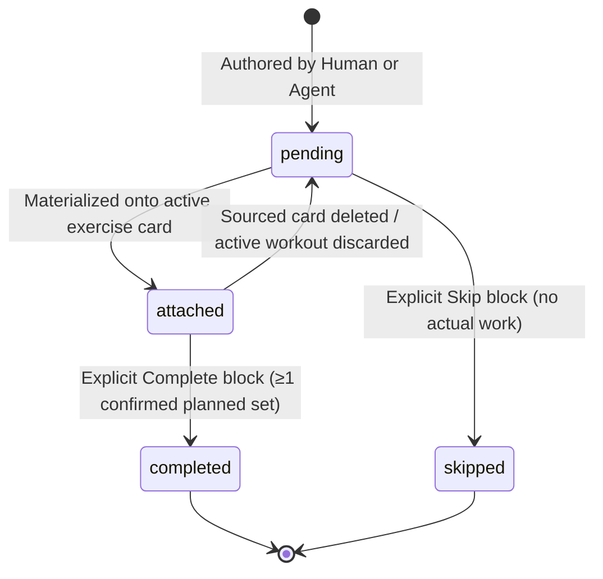

# Session Planning and Programmes Technical Contract

> **Status: authoritative technical contract.**  
> **Owns:** data model, schema, Sync v2 expansion (12 → 16 entities), materialization algorithms, block-level consumption and resolution lifecycle, set reordering invariants, agent authorization and write API, and MCP tool specifications.  
> **Complements:** [00-product](../00-product.md), [03-technical-architecture](../03-technical-architecture.md), [05-data-model](../05-data-model.md), [sync-v2-server-contract](sync-v2-server-contract.md), [10-api-authn-authz-guidelines](../10-api-authn-authz-guidelines.md), [08-ux-delivery-standard](../08-ux-delivery-standard.md).

---

## 1. Architectural Decisions and Principles

1. **Separation of Domains (Blueprint vs. Performed):**
   Plans and programmes represent authored intent (blueprints); they are never live workout state. `sessions.status` remains strictly `active | completed`. Plan and programme rows are excluded from performed workout history, volume analytics, personal records, and group activity feeds. Only materialized rows confirmed in the performed graph contribute to analytics.
2. **Materialization via Standard Entities:**
   Starting a plan or consuming an exercise block materializes ordinary `session_exercises` and `exercise_sets` rows. The recorder does not enter a "planning mode"; it continues to operate as an active recorder with standard draft and autosave mechanics.
3. **Exercise Block as Unit of Consumption and Progress:**
   A plan exercise (`session_plan_exercises`) plus its ordered target sets (`session_plan_sets`) forms an independently consumable block. A user can attach a single planned block (e.g. a squat block from a 6-week wave) to an active session, perform arbitrary unrelated freeform exercises, and explicitly resolve only that block without consuming the rest of the programme.
4. **Deterministic Provenance and Partial Uniqueness:**
   Performed-domain rows reference source plan rows via nullable foreign keys:
   - `sessions.source_plan_id -> session_plans(id)`
   - `session_exercises.source_plan_exercise_id -> session_plan_exercises(id)`
   - `exercise_sets.source_plan_set_id -> session_plan_sets(id)`
   Partial unique indexes ensure at most one live (non-deleted) performed session per whole-plan start, at most one live performed exercise card per plan block, and at most one live performed set per plan target set. Retries and multi-device sync converge deterministically, including concurrent block attachments (§4.5).
5. **Set Reordering Invariant:**
   Inside an exercise card, performed sets can be reordered freely (manual warm-ups added before or after planned sets). Reordering mutates only performed `exercise_sets.order_index`. It never alters source-plan target order, row identities, or provenance links (`source_plan_set_id`).
6. **Separate, Opt-In Agent Permissions:**
   The base Supabase OAuth grant remains strictly read-only. AI coaching agents can read upcoming plans and create new plans/programmes only when granted explicit, per-client permission via `public.agent_plan_permissions`. Agents cannot edit/delete plans, start workouts, or mutate performed workout history.
7. **Exhaustive Coaching Reads:**
   Coaching history reads (exercise history, workout detail) drain qualifying history via stable keyset cursors to exhaustion. Silent row caps and unpaginated truncations are prohibited.

---

## 2. Data Model and Schema

### 2.1 New Synced Entity Tables (Sync v2)

All four entities are user-owned, composite-keyed `(owner_user_id, id)` on Postgres, with standard Sync v2 sync fields: `client_updated_at_ms`, `server_received_at`, and `deleted_at`. Foreign keys use `DEFERRABLE INITIALLY DEFERRED`.

#### A. `training_programmes`
An ordered collection of planned sessions (e.g. a 6-week wave or split).

| Column | Client Type | Server Type | Nullable | Description / Constraints |
| :--- | :--- | :--- | :--- | :--- |
| `id` | `string` | `text` | NO | ULID, composite PK with `owner_user_id` |
| `name` | `string` | `text` | NO | Programme title (1..100 characters) |
| `description` | `string \| null` | `text` | YES | Optional description (max 500 characters) |
| `createdAt` / `created_at` | `number` | `bigint` | NO | Epoch milliseconds |
| `updatedAt` / `updated_at` | `number` | `bigint` | NO | Epoch milliseconds |
| `deletedAt` / `deleted_at` | `number \| null` | `bigint` | YES | Tombstone timestamp |

#### B. `session_plans`
A single authored future session, either standalone or belonging to a programme.

| Column | Client Type | Server Type | Nullable | Description / Constraints |
| :--- | :--- | :--- | :--- | :--- |
| `id` | `string` | `text` | NO | ULID, composite PK with `owner_user_id` |
| `programmeId` / `programme_id` | `string \| null` | `text` | YES | FK `(owner_user_id, programme_id) -> training_programmes(owner_user_id, id) ON DELETE SET NULL` |
| `programmeOrderIndex` / `programme_order_index` | `number \| null` | `integer` | YES | 0-based ordering within programme |
| `gymId` / `gym_id` | `string \| null` | `text` | YES | FK `(owner_user_id, gym_id) -> gyms(owner_user_id, id) ON DELETE SET NULL` |
| `title` | `string` | `text` | NO | Plan title (1..100 characters) |
| `scheduledFor` / `scheduled_for` | `number \| null` | `bigint` | YES | Optional epoch ms; null means unscheduled queue |
| `provenance` | `string` | `text` | NO | `'human' \| 'agent'`, default `'human'` |
| `createdAt` / `created_at` | `number` | `bigint` | NO | Epoch milliseconds |
| `updatedAt` / `updated_at` | `number` | `bigint` | NO | Epoch milliseconds |
| `deletedAt` / `deleted_at` | `number \| null` | `bigint` | YES | Tombstone timestamp |

#### C. `session_plan_exercises`
An ordered, independently consumable exercise block within a plan.

| Column | Client Type | Server Type | Nullable | Description / Constraints |
| :--- | :--- | :--- | :--- | :--- |
| `id` | `string` | `text` | NO | ULID, composite PK with `owner_user_id` |
| `sessionPlanId` / `session_plan_id` | `string` | `text` | NO | FK `(owner_user_id, session_plan_id) -> session_plans(owner_user_id, id) ON DELETE CASCADE` |
| `exerciseDefinitionId` / `exercise_definition_id` | `string \| null` | `text` | YES | FK `(owner_user_id, exercise_definition_id) -> exercise_definitions(owner_user_id, id) ON DELETE SET NULL` |
| `orderIndex` / `order_index` | `number` | `integer` | NO | 0-based dense sequence in plan |
| `name` | `string` | `text` | NO | Snapshot exercise name (1..100 characters) |
| `machineName` / `machine_name` | `string \| null` | `text` | YES | Snapshot machine/equipment name |
| `progressStatus` / `progress_status` | `string` | `text` | NO | `'pending' \| 'completed' \| 'skipped'`, default `'pending'` |
| `resolvedAt` / `resolved_at` | `number \| null` | `bigint` | YES | Timestamp when completed or skipped |
| `createdAt` / `created_at` | `number` | `bigint` | NO | Epoch milliseconds |
| `updatedAt` / `updated_at` | `number` | `bigint` | NO | Epoch milliseconds |
| `deletedAt` / `deleted_at` | `number \| null` | `bigint` | YES | Tombstone timestamp |

Check constraint: `CHECK (progress_status IN ('pending', 'completed', 'skipped'))`.  
Check constraint: `CHECK (resolved_at IS NULL OR progress_status IN ('completed', 'skipped'))`.

#### D. `session_plan_sets`
An ordered target set for a planned exercise.

| Column | Client Type | Server Type | Nullable | Description / Constraints |
| :--- | :--- | :--- | :--- | :--- |
| `id` | `string` | `text` | NO | ULID, composite PK with `owner_user_id` |
| `sessionPlanExerciseId` / `session_plan_exercise_id` | `string` | `text` | NO | FK `(owner_user_id, session_plan_exercise_id) -> session_plan_exercises(owner_user_id, id) ON DELETE CASCADE` |
| `orderIndex` / `order_index` | `number` | `integer` | NO | 0-based dense sequence in exercise block |
| `targetWeightValue` / `target_weight_value` | `string \| null` | `text` | YES | Non-negative numeric text in kg; null means "choose during workout" |
| `targetReps` / `target_reps` | `number` | `integer` | NO | Required positive integer (1..999) |
| `targetSetType` / `target_set_type` | `string \| null` | `text` | YES | Optional standard set type (e.g. `'work'`, `'warm_up'`, `'rir_1'`) |
| `createdAt` / `created_at` | `number` | `bigint` | NO | Epoch milliseconds |
| `updatedAt` / `updated_at` | `number` | `bigint` | NO | Epoch milliseconds |
| `deletedAt` / `deleted_at` | `number \| null` | `bigint` | YES | Tombstone timestamp |

Check constraint: `CHECK (target_reps > 0)`.

---

### 2.2 Performed-Domain Provenance Fields

The existing performed schema is augmented with nullable source links and partial uniqueness guards:

1. **`sessions.source_plan_id`** (`text`, nullable):
   - FK: `(owner_user_id, source_plan_id) -> session_plans(owner_user_id, id) ON DELETE SET NULL DEFERRABLE INITIALLY DEFERRED`.
   - Partial unique index: `sessions_owner_source_plan_unique` on `(owner_user_id, source_plan_id) WHERE deleted_at IS NULL AND source_plan_id IS NOT NULL`.
   - Set only on whole-plan starts (`startSessionPlan`). Manual sessions and single-block attachment leave it null.
2. **`session_exercises.source_plan_exercise_id`** (`text`, nullable):
   - FK: `(owner_user_id, source_plan_exercise_id) -> session_plan_exercises(owner_user_id, id) ON DELETE SET NULL DEFERRABLE INITIALLY DEFERRED`.
   - Partial unique index: `session_exercises_owner_source_block_unique` on `(owner_user_id, source_plan_exercise_id) WHERE deleted_at IS NULL AND source_plan_exercise_id IS NOT NULL`.
   - Unsourced/manual exercise cards leave it null.
3. **`exercise_sets.source_plan_set_id`** (`text`, nullable):
   - FK: `(owner_user_id, source_plan_set_id) -> session_plan_sets(owner_user_id, id) ON DELETE SET NULL DEFERRABLE INITIALLY DEFERRED`.
   - Partial unique index: `exercise_sets_owner_source_set_unique` on `(owner_user_id, source_plan_set_id) WHERE deleted_at IS NULL AND source_plan_set_id IS NOT NULL`.
   - Manual sets (e.g. warm-ups) leave it null.

#### Cross-Level Provenance Invariant
A performed set with `source_plan_set_id IS NOT NULL` is valid **if and only if** its parent `session_exercises` row has `source_plan_exercise_id` matching that plan set's parent `session_plan_exercise_id`.
- An unsourced exercise card cannot contain source-derived sets.
- A sourced card may mix matching source-derived sets with null-linked manual sets (warm-ups/drop sets).
- Server sync push triggers and local transactions reject cross-level mismatches atomically.
- These indexes also arbitrate concurrent attachments of the same block (§4.5): the first committed attachment wins, the loser reverts deterministically.

---

### 2.3 Non-Sync Control Tables

#### A. `public.agent_plan_permissions`
App-owned permission controlling whether a connected coaching agent can create plans or inspect upcoming plans.

```sql
create table public.agent_plan_permissions (
  owner_user_id uuid not null references auth.users(id) on delete cascade,
  client_id text not null,
  plan_access_enabled boolean not null default false,
  granted_at timestamptz not null,
  created_at timestamptz not null default now(),
  updated_at timestamptz not null default now(),
  primary key (owner_user_id, client_id)
);
```
- Direct table access is granted only to authenticated users matching `auth.uid() = owner_user_id` when `(auth.jwt() ->> 'client_id') IS NULL`.
- `anon` and OAuth client bearer tokens are denied by RLS.
- Missing row or `granted_at` mismatching the live OAuth token's grant timestamp yields `403 PLAN_PERMISSION_REQUIRED`.

#### B. `public.agent_plan_write_receipts`
Service-role only storage ensuring idempotent agent plan writes.

```sql
create table public.agent_plan_write_receipts (
  owner_user_id uuid not null references auth.users(id) on delete cascade,
  client_id text not null,
  operation text not null,
  idempotency_key text not null,
  payload_sha256 text not null,
  result_ids jsonb not null,
  created_at timestamptz not null default now(),
  primary key (owner_user_id, client_id, operation, idempotency_key)
);
```
- RLS enabled; no client policies; service-role only.
- Does not store workout or training payloads; stores only the SHA-256 payload hash and emitted entity IDs.

---

## 3. Sync v2 Topology and Layer Migration

Sync v2 expands from **twelve to sixteen** user-owned entity types.

### 3.1 Five-Layer Topological Order (`TOPO_LAYERS`)

| Layer | Entities in Layer | Foreign Key Dependencies to Strictly Earlier Layers |
| :--- | :--- | :--- |
| **0** | `gyms`, `exercise_definitions`, `muscle_groups`, `user_settings`, `training_programmes` | None |
| **1** | `session_plans`, `exercise_muscle_mappings`, `exercise_tag_definitions`, `exercise_group_links` | `session_plans → gyms, training_programmes`<br>`exercise_muscle_mappings → exercise_definitions, muscle_groups`<br>`exercise_tag_definitions → exercise_definitions`<br>`exercise_group_links → exercise_definitions` |
| **2** | `sessions`, `session_plan_exercises` | `sessions → gyms (L0), session_plans (L1)`<br>`session_plan_exercises → exercise_definitions (L0), session_plans (L1)` |
| **3** | `session_exercises`, `session_plan_sets` | `session_exercises → sessions (L2), exercise_definitions (L0), session_plan_exercises (L2)`<br>`session_plan_sets → session_plan_exercises (L2)` |
| **4** | `exercise_sets`, `session_exercise_tags`, `body_weight_measurements` | `exercise_sets → session_exercises (L3), session_plan_sets (L3)`<br>`session_exercise_tags → session_exercises (L3), exercise_tag_definitions (L1)`<br>`body_weight_measurements → None` (independent private root) |

**Invariants Satisfied:**
1. Zero intra-layer foreign keys.
2. Every FK points to a strictly lower layer index.
3. No self-referencing entities.

### 3.2 Pull Cursor Reset and Protocol-4 Gate

In the 12-entity schema, `sessions` was in Layer 1, `session_exercises` in Layer 2, and `exercise_sets` in Layer 3. In the 16-entity schema, they sit in Layers 2, 3, and 4 respectively — and Layers 0–3 each additionally gain at least one new entity type. No cursor arithmetic preserves every entity's unread range across that reshuffle: a shifted cursor lets a `session_plan` download without its `training_programmes` parent (FK failure on insert) or silently skips new blocks and sets, and shifting into Layer 4 destroys the independent `body_weight_measurements` cursor. Cursor remapping is therefore rejected; the client resets instead.

Because client pull cursors are stored as a JSON dictionary `pull_cursor` in `sync_runtime_state` keyed by layer integer (`{"0": ..., "1": ...}`):
- **Local SQLite Migration (0013):** During migration to the 16-entity schema, the client sets `pull_cursor` to `{}`. The next sync re-drains every layer from its earliest position; replayed rows upsert as idempotent LWW merges (rows already at their current state are no-ops), so the replay is safe and converges to the same state. The cost is one full historical replay per device after upgrading — accepted in exchange for deleting the bespoke remapping and its orphaning failure modes.
- **Protocol-4 Gate (server):** The server's layer-to-table projection flip in `sync_pull`/`sync_push` is a breaking protocol change and is gated on sync protocol 4 (`x-boga-sync-protocol: 4`), following the protocol-3 cutover precedent in [sync-v2-server-contract](sync-v2-server-contract.md) ("Migration-in-flight contract"): the compatibility client ships first, sync is stopped with `UPDATE_REQUIRED`, the server switches the projection, and only protocol-4 clients resume. A protocol-3 client never observes the new mapping, so a client filtering rows by its own layer list can never advance the page cursor past rows it dropped.

---

## 4. Lifecycle and Materialization

### 4.1 Plan Block Lifecycle



- **Pending:** Block is available for use. Eligible future unattached blocks remain fully editable.
- **Attached:** Block has been materialized onto an active session card. Attached blocks are read-only.
- **Completed:** Block was performed. Requires explicit user completion after at least 1 valid confirmed source-derived set (`exercise_sets.source_plan_set_id IS NOT NULL`). Manual warm-ups alone cannot complete the block. Target deviations (reps/weight) do not prevent completion.
- **Skipped:** Explicitly skipped from programme detail without creating performed rows.
- **Derived Progress:** Derived parent progress (`planned | in_progress | completed`) is computed dynamically from child block states.

### 4.2 Start All (`startSessionPlan`)

1. **Active Check:** If an active session exists (`sessions.status = 'active' AND deleted_at IS NULL`):
   - Return typed `ACTIVE_SESSION_CONFLICT`.
   - UI routes to **Resume Active Session**; never replaces or auto-completes.
2. **Transaction:** In one local database transaction:
   - If no block qualifies under the eligibility rule below, return typed `NO_PENDING_BLOCKS` and create nothing.
   - Create `sessions` row with `source_plan_id = plan.id`, `gym_id = plan.gym_id`, `status = 'active'`, `started_at = Date.now()`.
   - For each eligible pending block — `progress_status = 'pending'` and `deleted_at IS NULL`, ordered by `order_index`. Completed and skipped blocks are never re-materialized (doing so would violate source-block uniqueness and re-materialize skipped work):
     - Create `session_exercises` row with `session_id = session.id`, `source_plan_exercise_id = plan_exercise.id`, exercise name snapshot, machine snapshot, `order_index`.
     - For each non-deleted `session_plan_sets` row:
       - Create `exercise_sets` row with `session_exercise_id = session_exercise.id`, `source_plan_set_id = plan_set.id`, `order_index = plan_set.order_index`.
       - Copy targets: `planned_weight_value = plan_set.target_weight_value`, `planned_reps_value = plan_set.target_reps`, `planned_set_type = plan_set.target_set_type`.
       - Actuals blank: `weight_value = ''`, `reps_value = ''`, `set_type = 'work'`.
       - Status: `performance_status = 'planned'`.
3. **Deterministic ID Generation:**
   - Generated IDs reuse the existing deterministic text-ID pattern (`exerciseGroupLinkId` in `src/data/exercise-group-links.ts`), composed from owner and source ID:
     - `session_id`: `` `${ownerId}:${plan.id}:start` ``
     - `session_exercise_id`: `` `${ownerId}:${plan_exercise.id}:start` ``
     - `exercise_set_id`: `` `${ownerId}:${plan_set.id}:start` ``
   - Retries on the same plan return the existing active session without duplicating rows.

### 4.3 Add Plan Block (`addPlanBlockToSession`)

Appends a single planned exercise block to an active session, or starts an active session if none exists:

1. **Session Resolution:** If no active session exists, creates one using `plan.gym_id`. If active session exists, uses it (`sessions.source_plan_id` remains null if active session was started manually).
2. **Card Compatibility & Matching:**
   - A compatible card in the active session is an unsourced card (`source_plan_exercise_id IS NULL`) referencing the same non-null `exercise_definition_id`.
   - **Case A (Explicit Target):** If `targetSessionExerciseId` was provided and valid -> attaches to that card.
   - **Case B (Single Unambiguous Match):** Exactly 1 unsourced compatible card exists -> attaches automatically to that card.
   - **Case C (Ambiguity):** 2 or more unsourced compatible cards exist -> returns typed `AMBIGUOUS_COMPATIBLE_CARDS` with candidate card IDs. Writes nothing until user selects.
   - **Case D (No Match):** 0 compatible cards exist -> creates a new `session_exercises` row with `source_plan_exercise_id = planExercise.id`.
3. **Set Materialization & Ordering:**
   - On the target card, planned sets take the next dense `order_index` sequence following existing sets on that card:
     `order_index = existingSetCount + plan_set.order_index`.
   - Existing manual warm-ups remain above the planned sets by default.
   - Each set sets `source_plan_set_id = plan_set.id`, `performance_status = 'planned'`.

### 4.4 Set Reordering Operation (`reorderSessionExerciseSets`)

Allows manual warm-ups and planned sets on the same card to be reordered freely via playlist-style direct manipulation or VoiceOver actions:

```ts
reorderSessionExerciseSets(sessionExerciseId: string, orderedSetIds: string[]): Promise<void>
```
1. **Validation:**
   - Validates that `orderedSetIds` is an exact permutation of all non-deleted set IDs currently on `sessionExerciseId`.
   - Rejects missing, duplicate, or cross-card set IDs atomically.
2. **Persistence:**
   - Updates `exercise_sets.order_index` to match the array index (0, 1, 2, ...).
   - Keeps `id`, `source_plan_set_id`, `planned_*`, actual values, and performance state untouched.
   - Source plan order in `session_plan_sets` remains completely immutable.

### 4.5 Provenance Arbitration for Concurrent Attachments

Two offline devices can attach the same plan block to two different unsourced cards (§4.3 Cases B–D). The cards keep their own IDs, so per-row LWW cannot reconcile them. The §2.2 partial unique indexes are the arbiter, and the loser's repair path is defined so the permitted operation can never block sync:

1. **Server Arbitration:** `sync_push` is atomic per batch (single ack, no per-row outcomes). When a batch would create a second live provenance row for the same `(owner_user_id, source_plan_exercise_id)` on `session_exercises` — or the same `source_plan_set_id` on `exercise_sets` — the whole batch fails with typed error `BLOCK_ALREADY_ATTACHED`, carrying the winning card ID (the live row the index protects). The first committed attachment wins; server commit order is the only tiebreak.
2. **Loser Repair (deterministic):** On `BLOCK_ALREADY_ATTACHED`, the client pulls first so the winning card is visible, then reverts its own losing attachment: clear `source_plan_exercise_id` on the losing card and clear `source_plan_set_id` on its source-derived sets. Entered actuals and manual sets on that card are preserved; the card returns to unsourced, keeping the Cross-Level Provenance Invariant (§2.2) intact. The client then re-pushes the repaired batch.
3. **Convergence:** Every device ends with exactly one live card carrying the provenance link (the server-accepted winner), while the losing card keeps all user work as unsourced rows. Whole-plan starts need no arbitration: their deterministic IDs (§4.2) make a competing Start all resolve to the same row, not a second one.

---

## 5. UI and UX Contracts

### 5.1 Route and Screen Map

- **`/sessions` (Planning Hub):**
  - Divided into 4 distinct sections: **Active**, **Upcoming** (scheduled plans sorted by date), **Unscheduled** (unscheduled plans and programmes sorted by updated time), and **Completed** (performed workout history).
  - Integrates with the **Today tab**: Today surfaces the next upcoming scheduled workout or next programme block as a primary card with a direct Start action. Full queue management and authoring live in `/sessions`.
- **`/session-plan/new`:** Authoring a one-off plan. Target loads display load input mode indicators (`per_side_load` vs. `total_load`).
- **`/session-plan/[planId]`:** View/edit plan. Offers Start all, Duplicate, Delete (for unused/eligible plans), and Add block. Consumed blocks are read-only and link to their performed session.
- **`/programme/new`:** Authoring an ordered programme (minimum 2 child plans).
- **`/programme/[programmeId]`:** Programme detail showing overall progress, the next unresolved block in sequence, and child plan summaries.
- **Exercise Picker:**
  - Renames historical action from **Append plan** to **Repeat last**.
  - Adds a new entry: **From planner** to select available authored blocks.

### 5.2 Set Reordering UX
- Sets in the recorder feature a subtle trailing grab handle icon.
- Direct manipulation (drag and drop) lifts the row with clear insertion feedback without requiring a separate modal "Edit" mode.
- Non-drag accessibility: VoiceOver custom actions expose **Move earlier** and **Move later** on each set row.
- Reduced motion: disables lift animations while keeping full reorder functionality.

---

## 6. Agent API and MCP Tools

### 6.1 Agent API Routes (`functions/v1/agent-api`)

All agent routes enforce strict token validation, current-grant permission checks (`public.agent_plan_permissions`), and service-role isolation.

| Route | Method | Purpose | Permission Required |
| :--- | :--- | :--- | :--- |
| `/v1/agent/session-plans` | `GET` | Paginated upcoming and unscheduled plans | `plan_access_enabled = true` |
| `/v1/agent/session-plans` | `POST` | Atomically creates 1 plan graph (pending blocks only) | `plan_access_enabled = true` |
| `/v1/agent/programmes` | `POST` | Atomically creates 1 programme graph (pending blocks only) | `plan_access_enabled = true` |
| `/v1/agent/exercises/:exerciseId/history` | `GET` | Exhaustive keyset-paginated performed set history | Base read-only grant |
| `/v1/agent/workouts/:sessionId` | `GET` | Exact completed workout header and paginated sets | Base read-only grant |

- **Idempotency:** Both `POST` routes require an `idempotency_key` header (1..128 chars). Replaying the same key and payload returns the original result IDs from `public.agent_plan_write_receipts`. Same key with different payload returns `409 IDEMPOTENCY_CONFLICT`.
- **Exhaustive History:** `GET /v1/agent/exercises/:exerciseId/history` returns rows ordered by `(session_completed_at, session_id, exercise_order, set_order)` with an opaque continuation cursor. Database-side filtering prevents silent row omissions.

### 6.2 MCP Tool Surface (`services/boga-mcp`)

Expands from four read-only tools to **nine tools** (6 read-only, 3 separately authorized create-only):

1. `get_training_profile` (read-only, existing)
2. `search_exercises` (read-only, upgraded: complete database-side filtering without candidate preselection cap)
3. `get_exercise_context` (read-only, upgraded: exact lifetime PRs and totals invariant under page size)
4. `get_recent_workouts` (read-only, upgraded: exact workout counts and volume)
5. `get_exercise_history` (read-only, new: pageable exhaustive performed-set history)
6. `get_workout_detail` (read-only, new: exact workout header and paginated performed sets)
7. `get_upcoming_session_plans` (read-only, new: upcoming/unscheduled plan queues)
8. `create_session_plan` (create-only, new: creates one complete plan; requires plan permission)
9. `create_training_programme` (create-only, new: creates one multi-session programme; requires plan permission)

Mutation tools use annotations:
- `readOnlyHint: false`
- `idempotentHint: true`
- `destructiveHint: false`
- `openWorldHint: false`

---

## 7. Error Tokens and Validation Limits

### 7.1 Field and Graph Limits
- `title` / `name`: 1..100 characters.
- `description`: 0..500 characters.
- `programme` sessions: 2..50 plans.
- `session_plans` exercises: 1..30 blocks.
- `session_plan_exercises` sets: 1..30 sets.
- `target_reps`: integer in `1..999`.
- `target_weight_value`: valid decimal text in `0..9999.99` kg, or null.
- `idempotency_key`: 1..128 characters.

### 7.2 Stable Error Codes

| Error Code | HTTP Status | Meaning |
| :--- | :--- | :--- |
| `PLAN_PERMISSION_REQUIRED` | 403 | Client lacks active plan permission in `agent_plan_permissions` |
| `ACTIVE_SESSION_CONFLICT` | 409 | Start all attempted while another session is currently active |
| `AMBIGUOUS_COMPATIBLE_CARDS` | 409 | Multiple compatible unsourced exercise cards exist; selection required |
| `NO_PENDING_BLOCKS` | 409 | Start all attempted with no eligible pending block remaining (§4.2) |
| `BLOCK_ALREADY_ATTACHED` | 409 | Concurrent attachment of the same plan block; server arbitrated, loser reverts (§4.5) |
| `IDEMPOTENCY_CONFLICT` | 409 | Same idempotency key submitted with different payload |
| `FOREIGN_RESOURCE_REFERENCE` | 400 | Referenced exercise, gym, or plan does not belong to user |
| `INVALID_BLOCK_RESOLUTION` | 400 | Attempted to complete a block without at least 1 confirmed planned set |
| `IMMUTABLE_BLOCK_MUTATION` | 400 | Attempted to modify or delete an already attached or resolved block |
